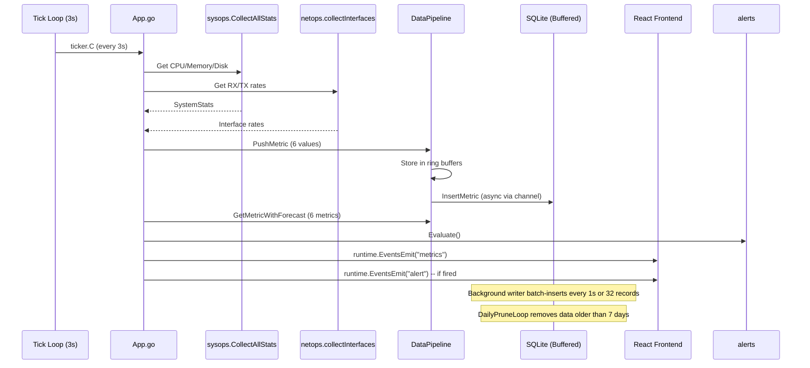
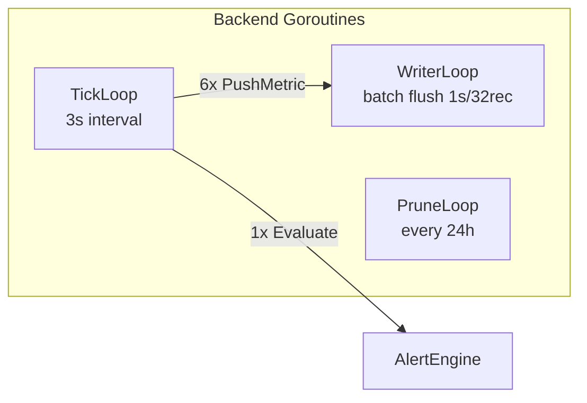
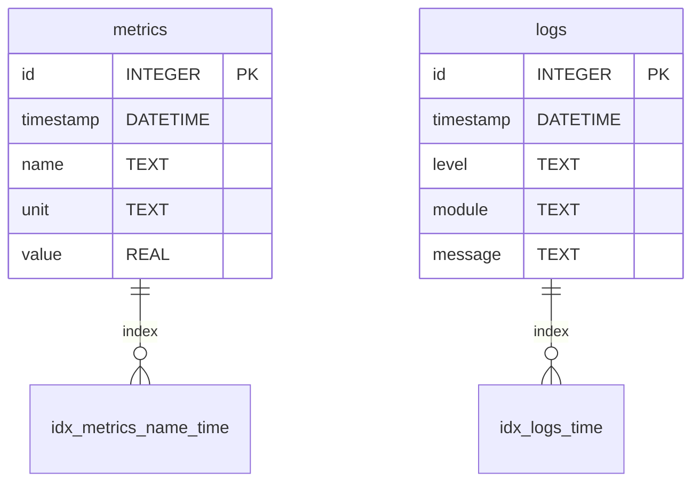

# Project Graph — AllOpsFull / Hawkward Operations Platform

## Entity Relationship Map

```mermaid
graph TB
    subgraph "Entry Points"
        main_go["main.go<br/>Wails v2 App"]
    end

    subgraph "Backend — Go (Wails Bindings)"
        App_go["internal/app/App.go<br/>NewApp() + Startup() + TickLoop"]
        SysOps["internal/app/SysOps.go<br/>CPU/Memory/Disk/Processes"]
        NetOps["internal/app/NetOps.go<br/>Ping/DNS/PortScan/Traceroute"]
        SecOps["internal/app/SecOps.go<br/>Firewall/Users/Defender"]
        DevOps["internal/app/DevOps.go<br/>Shell/FileBrowser/Services"]
        AIOps["internal/app/AIOps.go<br/>Ollama Chat/Report"]
        Dashboard["internal/app/Dashboard.go<br/>Aggregated KPIs"]
        PipelineAPI["internal/app/Pipeline.go<br/>Pipeline Control"]
        AlertAPI["internal/app/Alerts.go<br/>Alert Rules"]
        Logs["internal/app/Logs.go<br/>Log Export/Filter"]
        Events["internal/app/Events.go<br/>Event Structs"]
        Types["internal/app/Types.go<br/>Shared Types"]
    end

    subgraph "Core Libraries — Go"
        common_pkg["internal/common/<br/>Pipeline, Storage, Alerts,<br/>Logger, Sandbox, Theme,<br/>Types, Metrics, Forecast"]
        storage["storage.go<br/>SQLite (hawkward.db)<br/>WAL mode, buffered writes"]
        pipeline["pipeline.go<br/>DataPipeline + PushMetric"]
        alerts["alerts.go<br/>AlertEngine + Rules"]
        sandbox["sandbox.go<br/>SandboxedCommand()"]
        charts["internal/common/charts/<br/>Chart types (TUI legacy)"]
    end

    subgraph "Domain Libraries — Go"
        sysops_lib["internal/sysops/<br/>CPU, Memory, Disk,<br/>Processes, System Info"]
        netops_lib["internal/netops/<br/>DNS, Ping, PortScan,<br/>Traceroute, Connections"]
        secops_lib["internal/secops/<br/>Firewall, Defender,<br/>Listening Ports, Tasks"]
        devops_lib["internal/devops/<br/>Shell, FileBrowser,<br/>Services, LogTail"]
        aiops_lib["internal/aiops/<br/>Ollama Client,<br/>Report Generation"]
    end

    subgraph "Frontend — React + TypeScript + Vite"
        App_tsx["src/App.tsx<br/>Router + Layout"]
        Pages["src/pages/<br/>Dashboard, SysOps, NetOps,<br/>SecOps, DevOps, AIOps,<br/>Logs, Settings, NetworkDesign"]
        Components["src/components/<br/>GaugeCard, Sidebar,<br/>MetricChart, LoadingSkeleton"]
        Hooks["src/hooks/<br/>useBackend, useEvents"]
        Lib["src/lib/<br/>constants.ts, utils.ts"]
        Styles["src/styles/globals.css<br/>Squib design system"]
    end

    subgraph "Release Pipeline"
        GHA_Test[".github/workflows/test.yml"]
        GHA_Release[".github/workflows/release.yml"]
        Scripts["scripts/<br/>build.bat, build.sh<br/>release.ps1, release-gh.sh"]
        README["README.md<br/>Download section"]
    end

    %% Connections
    main_go --> App_go
    App_go --> SysOps & NetOps & SecOps & DevOps & AIOps & Dashboard & PipelineAPI & AlertAPI & Logs
    
    SysOps --> sysops_lib
    NetOps --> netops_lib
    SecOps --> secops_lib
    DevOps --> devops_lib
    AIOps --> aiops_lib
    
    App_go --> common_pkg
    common_pkg --> storage & pipeline & alerts & sandbox
    
    App_go -- "EventsEmit" --> Hooks
    Hooks -- "Wails runtime" --> Pages
    
    Scripts --> GHA_Release
    GHA_Test & GHA_Release --> README
```

## Data Flow

## Concurrent Routes

## SQLite Database Schema

## Remaining Work Items (Kanban)

| ID | Status | Description | Dependencies |
|----|--------|-------------|-------------|
| S-06 | 🔲 TODO | Tag & publish v1.0.0 on GitHub | All below, then git tag push |
| P-01 | 🔲 TODO | Fix 3 failing frontend tests (Dashboard, Settings, Sidebar) | None |
| P-02 | 🔲 TODO | Fix `max` dead code in netops/view.go (TUI remnant) | None |
| P-03 | 🔲 TODO | Add NSIS installer note to README | Dependent on S-06 |
