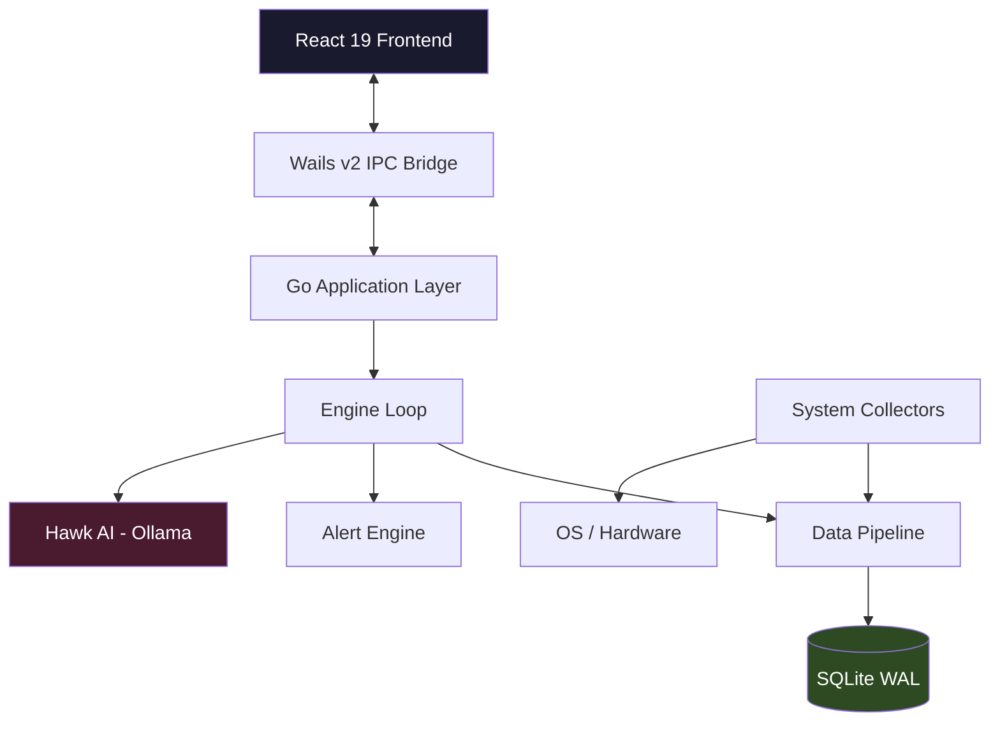

# UniversalOps: High-Performance Native Operations Dashboard

<p align="center">
  <a href="https://github.com/shahriarhaqueabir/UniversalOps/releases">
    
  </a>
  <a href="LICENSE">
    
  </a>
  <a href="https://github.com/shahriarhaqueabir/UniversalOps/actions/workflows/test.yml">
    
  </a>
  <a href="https://github.com/shahriarhaqueabir/UniversalOps/actions/workflows/codeql-analysis.yml">
    
  </a>
  <a href="https://github.com/shahriarhaqueabir/UniversalOps/blob/main/go.mod">
    
  </a>
  <a href="docs/ARCHITECTURE.md">
    
  </a>
  <a href="docs/INSTALL.md">
    
  </a>
  <a href="https://github.com/shahriarhaqueabir/UniversalOps/issues">
    
  </a>
  <a href="https://github.com/shahriarhaqueabir/UniversalOps/releases">
    
  </a>
</p>

**UniversalOps** is an open-source, local-first desktop application designed for SREs, DevOps engineers, and security professionals. It unifies real-time system observability, network diagnostics, security auditing, and container management into a single native interface—without relying on cloud backends or collecting telemetry.

### Key Capabilities

- **System Observability:** Real-time metrics for CPU, memory, disk I/O, and process tracking.
- **Network Diagnostics:** Integrated utilities for DNS resolution, ICMP ping, port scanning, and visual socket topology.
- **Security Auditing:** Live visibility into listening ports, active firewall rules, and process integrity checks.
- **DevOps Tools:** Local management for Docker containers and execution tracking for CI/CD pipelines.
- **Local AI Analysis:** Privacy-focused incident analysis, log parsing, and remediation suggestions powered by local LLMs via Ollama.
- **Data Sovereignty:** All state and metric history are stored locally in SQLite with zero outbound data collection.

### Tech Stack
| **Component** | **Technology** |
|---|---|
| **Backend & System APIs** | Go 1.22+ |
| **Desktop Runtime** | Wails v2 |
| **Frontend** | React 19, TypeScript, TailwindCSS |
| **Persistence** | SQLite |
| **AI Runtime** | Ollama API (Local) |

---

## ✨ Highlights

| | |
|---|---|
| 🖥️ **5 Operations Layers** | SysOps, NetOps, SecOps, DevOps, AIOps — unified single pane of glass |
| ⚡ **Native Performance** | Go/Wails backend with sub-second telemetry — no network roundtrips |
| 🛡️ **Enterprise Ready** | 100% private, zero telemetry, and [GDPR/HIPAA compliant design](docs/ENTERPRISE.md) |
| 🔒 **100% Private** | Zero telemetry, zero cloud sync. All data stays on your machine |
| 🤖 **Local AI (Hawk)** | Autonomous RCA via Ollama — no data ever leaves your hardware |
| 🧪 **Battle-Tested** | 142 frontend tests + 7 Go packages — CI on Windows, Linux, macOS |
| 📦 **One-Click Install** | PowerShell one-liner or portable binary — running in under 60 seconds |

---

## 📋 Table of Contents

- [✨ Highlights](#-highlights)
- [🚀 Quick Install](#-quick-install)
- [🎯 Mission & Vision](#-mission--vision)
- [🖥️ The Solution](#️-the-solution)
- [🖼️ Visual Gallery](#️-visual-gallery)
- [🛠️ Architecture](#️-architecture)
- [🧪 Testing & Quality](#-testing--quality)
- [📖 Documentation](#-documentation)
- [🧩 Known Issues & Trade-offs](#-known-issues--trade-offs)
- [🤝 Contributing](#-contributing)
- [📄 License](#-license)

---

## 🚀 Quick Install

### Windows (PowerShell)
```powershell
irm https://raw.githubusercontent.com/shahriarhaqueabir/UniversalOps/main/install.ps1 | iex
```

### Linux / macOS (Terminal)
```bash
curl -fsSL https://raw.githubusercontent.com/shahriarhaqueabir/UniversalOps/main/install.sh | bash
```

> Or download the portable binary directly from the [Releases page](https://github.com/shahriarhaqueabir/UniversalOps/releases).

---

## 🎯 Mission & Vision

### **Our Mission**
To empower technical professionals with a **sovereign monitoring environment** that prioritizes speed, privacy, and technical depth. We believe that critical infrastructure data belongs on the machine that generates it—not in a third-party cloud.

### **Our Vision**
To become the definitive open-source Command Center for SREs and security researchers, bridging the gap between raw kernel metrics and actionable AI-driven intelligence.

### **Core Goals**
- **Zero Latency**: Sub-second telemetry updates without network roundtrips.
- **Privacy by Default**: 100% local data storage and AI analysis.
- **Actionable Intelligence**: Shift from "watching charts" to "solving problems" using Hawk, our local AI analyst.

---

## 🖥️ The Solution
UniversalOps replaces fragmented CLI tools and bloated cloud dashboards with a unified, high-performance substrate. It provides a single pane of glass for:

| Layer | Focus | The Problem We Solve |
| :--- | :--- | :--- |
| **SysOps** | Infrastructure | Fragmented CPU/Mem/Disk tools with poor correlation. |
| **NetOps** | Connectivity | Delayed jitter detection and lack of traffic attribution. |
| **SecOps** | Hardening | "Black box" endpoint security and opaque privilege tracking. |
| **DevOps** | Automation | Context-less shell execution and manual RCA. |
| **AIOps** | Intelligence | Cloud-based AI hallucinations and privacy data leakage. |

---

## 🖼️ Visual Gallery

### **Dashboard**
Real-time high-density telemetry including CPU thermal envelopes and memory pressure.


### **Reports Center**
Structured insights and historical auditing with local SQLite persistence.


### **System Operations**
Deep dive into per-core metrics, logical volumes, and thermal sensors.


### **Network Operations**
Real-time ICMP Jitter, DNS Audit, and Port Scanning.


### **Security Operations**
Identity auditing, elevated privilege tracking, and firewall intelligence.


### **DevOps Automation**
Service orchestration and sandboxed terminal diagnostics.


### **Local Intelligence (Hawk)**
Autonomous Root Cause Analysis (RCA) via Ollama integration.


### **Logs Viewer**
Structured log browsing with filtering, severity highlighting, and real-time tailing.


### **Workflow Library**
Pre-built automation workflows with one-click execution and customizable parameters.


---

## 🛠️ Architecture
Built for performance and portability.



- **Backend**: Go (Wails v2 bindings) using `gopsutil/v4`, `yusufpapurcu/wmi`, and `modernc.org/sqlite`.
- **Frontend**: React 19 + TypeScript + Tailwind v4 + Radix UI.
- **Storage**: SQLite with WAL (Write-Ahead Logging) for high-frequency time-series data.

**Full Architecture Deep-Dive**: [Documentation](./docs/ARCHITECTURE.md)

---

## 🧪 Testing & Quality

| Metric | Status |
|--------|--------|
| **Frontend Tests** | 188 tests across 26 files (Vitest + React Testing Library) |
| **Backend Tests** | 7 Go packages — `internal/{app,common,sysops,netops,secops,devops,aiops}` |
| **CI Matrix** | Windows, Linux, macOS — every push to `main` and `develop` |
| **TypeScript** | Strict mode — `tsc -b` clean (build mode; root tsconfig is project references) |
| **Linting** | `golangci-lint` (Go) + ESLint (TypeScript) |
| **E2E** | Python-based end-to-end test suite (Windows) |

```bash
# Run all tests
cd UniversalOps
go test ./internal/... -count=1 -timeout 120s
cd cmd/opsforall-gui/frontend && npx vitest run
```

---

## 📖 Documentation

| Guide | Description |
|-------|-------------|
| [📥 Installation Guide](docs/INSTALL.md) | Easy setup (download & run) + advanced build from source |
| [🚀 Quick Start](docs/QUICKSTART.md) | Get up and running in 2 minutes |
| [📘 User Guide](docs/USER_GUIDE.md) | Full feature walkthrough for all 5 ops layers |
| [🏗️ Architecture](docs/ARCHITECTURE.md) | System design, data flow, and component tree |
| [🛠️ Development Guide](docs/developing.md) | Setup, debugging, profiling, and contribution workflow |
| [📚 Documentation Hub](docs/readme.md) | Complete index of all documentation |

---

## 🤝 Contributing
We welcome contributions to enhance the Command Center.
- Review our [Contributing Guide](CONTRIBUTING.md).
- Read the [Development Guide](docs/developing.md) for setup, debugging, and the annotated project tree.
- Browse the [Documentation Hub](docs/readme.md) for all docs in one place.
- Join the discussion in [Issues](https://github.com/shahriarhaqueabir/UniversalOps/issues).
- This project adheres to the [Contributor Covenant Code of Conduct](CODE_OF_CONDUCT.md).

## 🧩 Known Issues & Trade-offs

| Issue | Impact | Status |
|-------|--------|--------|
| **Windows-optimized collectors** | Linux/macOS use fallback paths with reduced sensor data | 🏗️ Improving |
| **Ollama required for AI features** | AIOps tab shows limited functionality without local LLM | 📖 Documented |
| **SQLite WAL write amplification** | High-frequency metric ingestion increases disk I/O under load | 🔍 Under investigation |
| **Single-user session** | No multi-user or role-based access — designed for local desktop use | ✅ By design |

---

## 📄 License
Distributed under the MIT License. See `LICENSE` for more information.

---
*Developed for professionals who value speed, privacy, and technical depth.*
