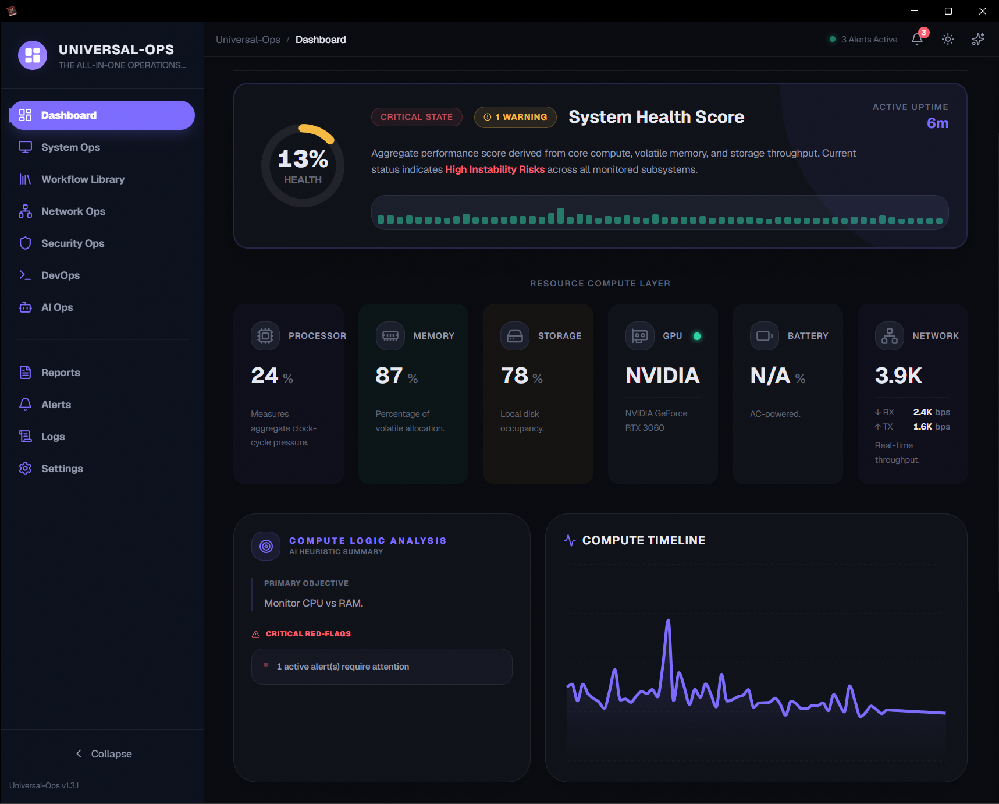
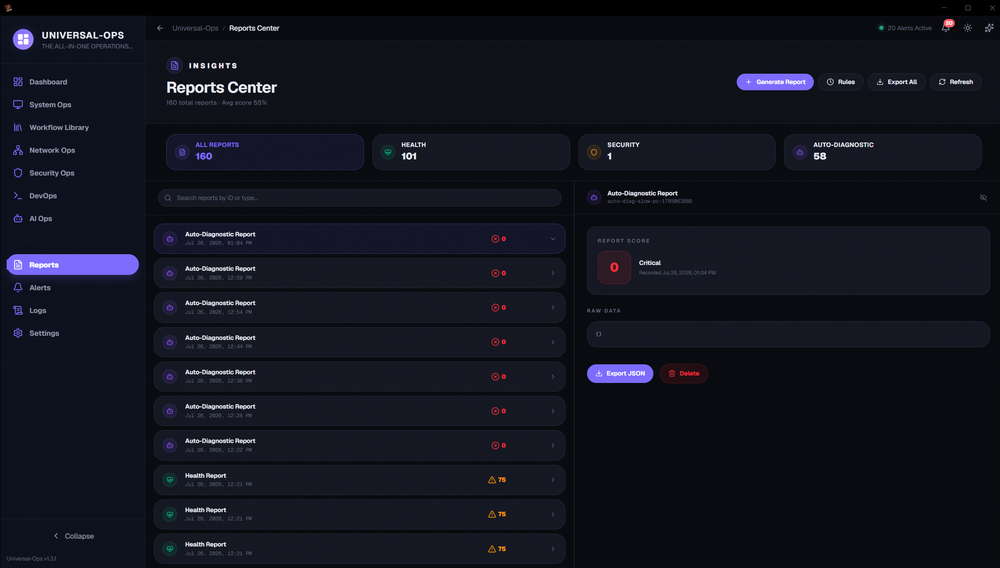
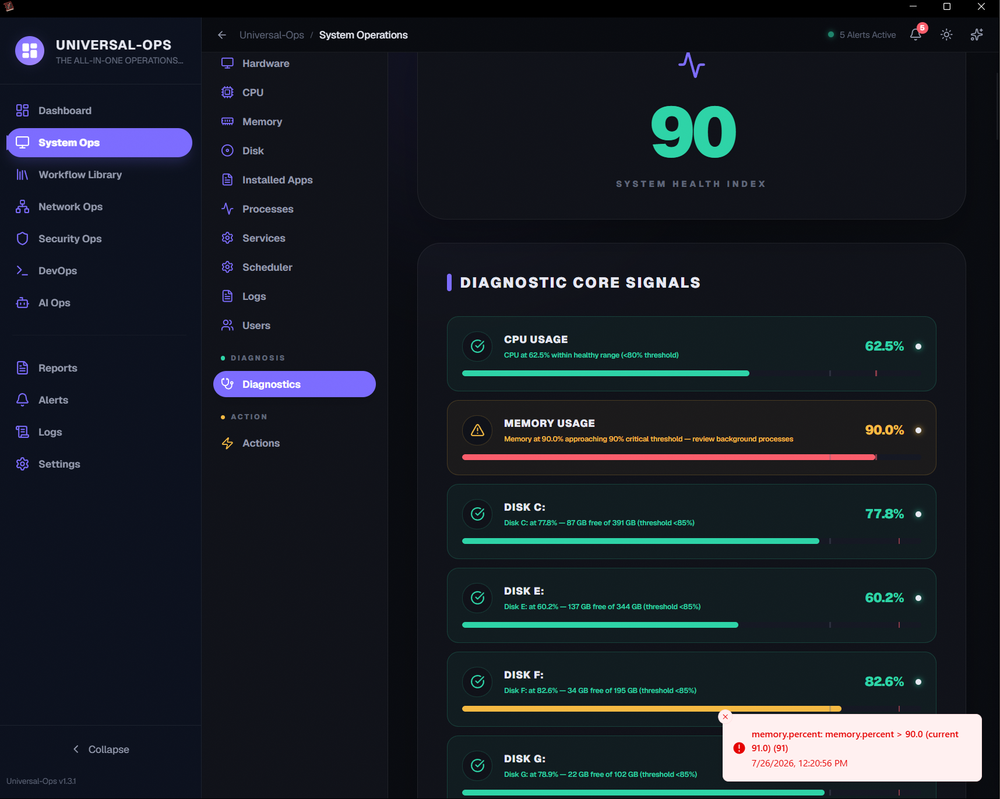
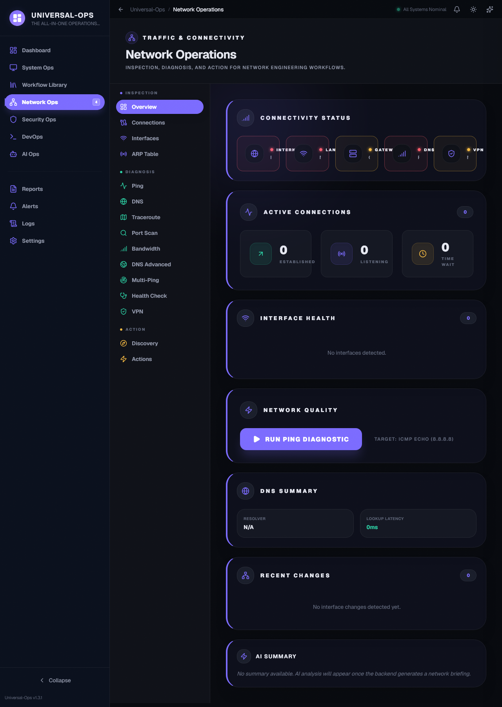
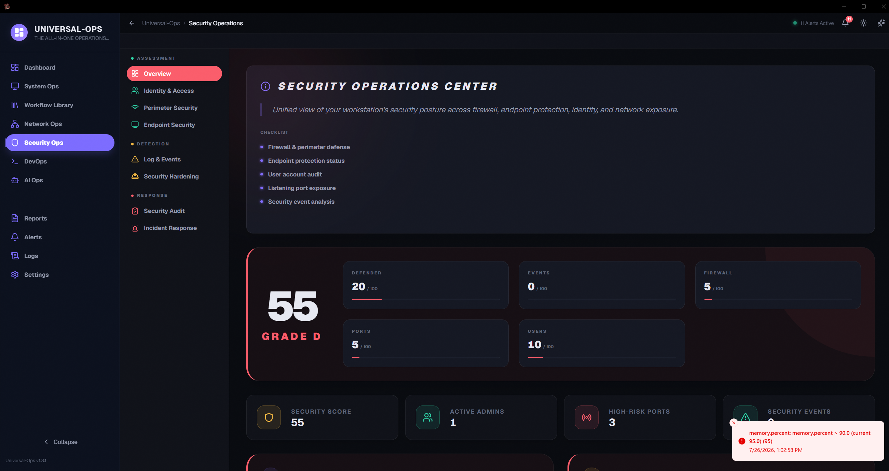
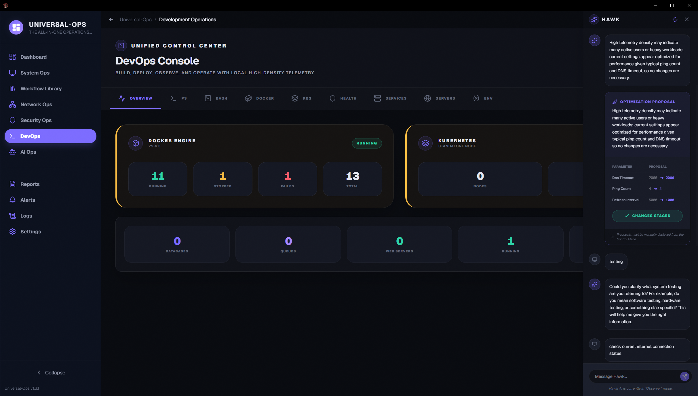
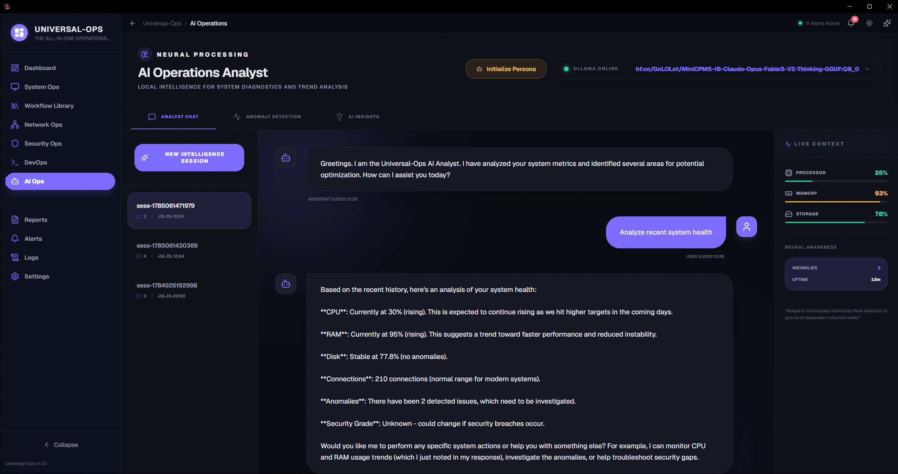
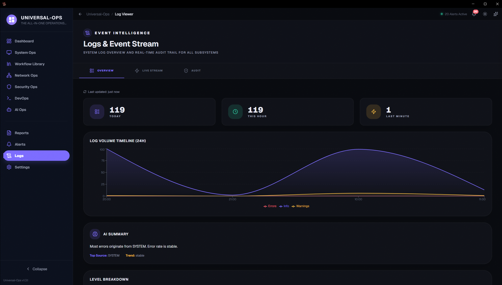
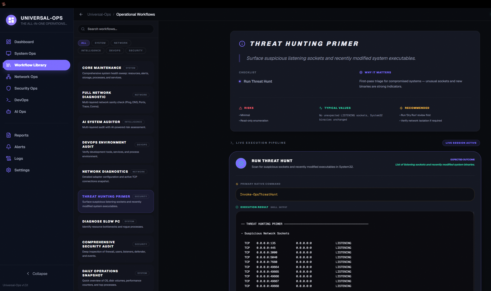

# UniversalOps: High-Performance Native Operations Dashboard

<p align="center">
  <a href="https://github.com/shahriarhaqueabir/UniversalOps/releases">
    
  </a>
  <a href="LICENSE">
    
  </a>
  <a href="https://github.com/shahriarhaqueabir/UniversalOps/actions">
    
  </a>
  <a href="https://github.com/shahriarhaqueabir/UniversalOps/blob/main/go.mod">
    
  </a>
  <a href="docs/ARCHITECTURE.md">
    
  </a>
  <a href="docs/INSTALL.md">
    
  </a>
  <a href="https://github.com/shahriarhaqueabir/UniversalOps/issues">
    
  </a>
  <a href="https://github.com/shahriarhaqueabir/UniversalOps/releases">
    
  </a>
</p>

**UniversalOps** is a native desktop studio designed for SREs, developers, and security enthusiasts who require instant, high-density telemetry without the latency or privacy risks of cloud-based monitoring.

> [!IMPORTANT]
> **100% Private. 100% Local. Zero Cloud.** Your data never leaves your hardware.

---

## 🚀 One-Line Installation (Windows)
Run this command in PowerShell to instantly set up UniversalOps on your desktop:
```powershell
irm https://raw.githubusercontent.com/shahriarhaqueabir/UniversalOps/main/install.ps1 | iex
```

---

## 🎯 Mission & Vision

### **Our Mission**
To empower technical professionals with a **sovereign monitoring environment** that prioritizes speed, privacy, and technical depth. We believe that critical infrastructure data belongs on the machine that generates it—not in a third-party cloud.

### **Our Vision**
To become the definitive open-source Command Center for SREs and security researchers, bridging the gap between raw kernel metrics and actionable AI-driven intelligence.

### **Core Goals**
- **Zero Latency**: Sub-second telemetry updates without network roundtrips.
- **Privacy by Default**: 100% local data storage and AI analysis.
- **Actionable Intelligence**: Shift from "watching charts" to "solving problems" using Hawk, our local AI analyst.

---

## 🖥️ The Solution
UniversalOps replaces fragmented CLI tools and bloated cloud dashboards with a unified, high-performance substrate. It provides a single pane of glass for:

| Layer | Focus | The Problem We Solve |
| :--- | :--- | :--- |
| **SysOps** | Infrastructure | Fragmented CPU/Mem/Disk tools with poor correlation. |
| **NetOps** | Connectivity | Delayed jitter detection and lack of traffic attribution. |
| **SecOps** | Hardening | "Black box" endpoint security and opaque privilege tracking. |
| **DevOps** | Automation | Context-less shell execution and manual RCA. |
| **AIOps** | Intelligence | Cloud-based AI hallucinations and privacy data leakage. |

---

## 🖼️ Visual Gallery

### **Dashboard**
Real-time high-density telemetry including CPU thermal envelopes and memory pressure.


### **Reports Center**
Structured insights and historical auditing with local SQLite persistence.


### **System Operations**
Deep dive into per-core metrics, logical volumes, and thermal sensors.


### **Network Operations**
Real-time ICMP Jitter, DNS Audit, and Port Scanning.


### **Security Operations**
Identity auditing, elevated privilege tracking, and firewall intelligence.


### **DevOps Automation**
Service orchestration and sandboxed terminal diagnostics.


### **Local Intelligence (Hawk)**
Autonomous Root Cause Analysis (RCA) via Ollama integration.


### **Logs Viewer**
Structured log browsing with filtering, severity highlighting, and real-time tailing.


### **Workflow Library**
Pre-built automation workflows with one-click execution and customizable parameters.


---

## 🛠️ Architecture
Built for performance and portability.
- **Backend**: Go (Wails v2 bindings) using `gopsutil/v4`, `yusufpapurcu/wmi`, and `modernc.org/sqlite`.
- **Frontend**: React 19 + TypeScript + Tailwind v4 + Radix UI.
- **Storage**: SQLite with WAL (Write-Ahead Logging) for high-frequency time-series data.

**Full Architecture Deep-Dive**: [Documentation](./docs/ARCHITECTURE.md)

---

## 🤝 Contributing
We welcome contributions to enhance the Command Center.
- Review our [Contributing Guide](CONTRIBUTING.md).
- Read the [Development Guide](docs/developing.md) for setup, debugging, and the annotated project tree.
- Browse the [Documentation Hub](docs/readme.md) for all docs in one place.
- Join the discussion in [Issues](https://github.com/shahriarhaqueabir/UniversalOps/issues).
- This project adheres to the [Contributor Covenant Code of Conduct](CODE_OF_CONDUCT.md).

---

## 📄 License
Distributed under the MIT License. See `LICENSE` for more information.

---
*Developed for professionals who value speed, privacy, and technical depth.*
