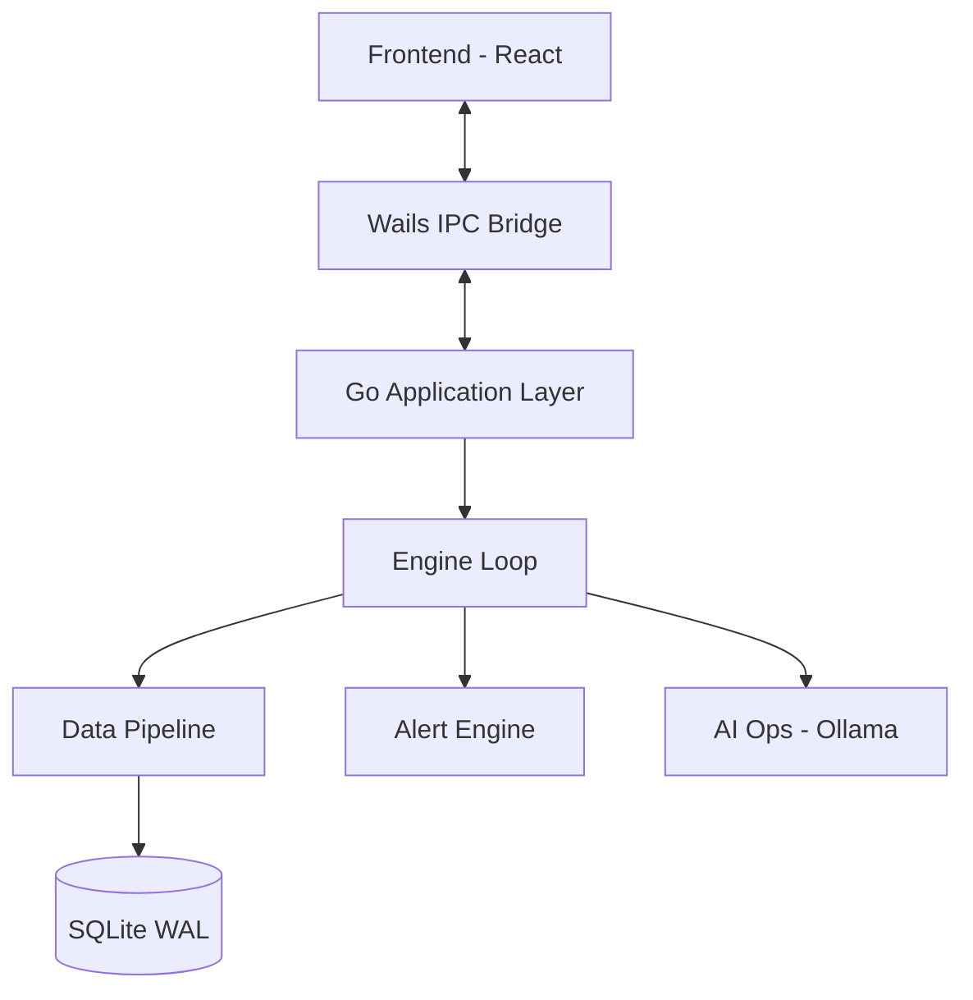
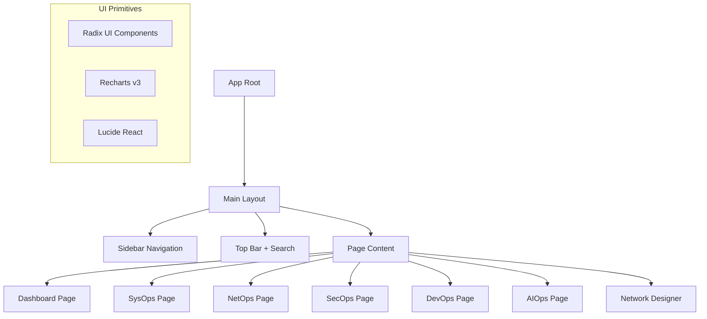
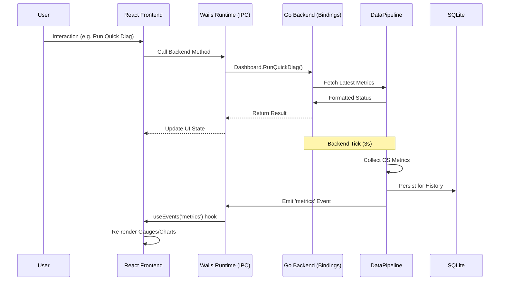

# Universal-Ops — Architecture Document

> A high-performance native desktop operations platform built with Go and Wails v2.

---

## 1. Overview
Universal-Ops provides a unified command center for system administrators, security professionals, and SREs. It bridges the gap between low-level kernel telemetry and actionable operational intelligence.

### Goals
- **100% Local**: Zero telemetry, zero cloud sync.
- **Native Efficiency**: Low-footprint Go backend with React frontend.
- **Hardened Execution**: Concurrent engine loop with sandboxed system queries.
- **AI-Augmented**: Integrated local LLM (Ollama) for automated analysis.

---

## 2. Core Components

### 🔄 The Engine Loop (`internal/common/engine.go`)
The heartbeat of the platform.
- **Parallelized Evaluation**: Executes alert rules and metric snapshots in concurrent lanes via `sync.WaitGroup`.
- **Drift Detection**: Continuously compares live data against `baseline.json`.
- **Spike Triggering**: Automatically executes diagnostic workflows (Autonomous Ops) when metric deviations are detected.

### 🧩 Capability Registry (`internal/common/capability.go`)
A multi-tiered discovery engine.
- **Detection Chain**: Probes `PATH`, standard application directories, and WMI namespaces.
- **External Bridge**: Seamlessly links with **Ollama** (AI) and **LibreHardwareMonitor** (Sensors).
- **Manual Verification**: Allows users to re-scan for newly installed dependencies without restarting the app.

---

## 3. Data Flow



### Storage Philosophy (SQLite WAL)
We use **Write-Ahead Logging (WAL)** mode to handle high-frequency metric ingestion from the `DataPipeline` without blocking read queries from the UI. Retention defaults to 7 days to maintain a balance between historical context and disk footprint.

### 1. SysOps (System Operations)
- CPU, RAM, disk, process monitoring.
- Real-time KPI cards with sparklines and per-core breakdown.
- **Hardware Forensics**: GPU temperature/utilization, fan speeds, and baseboard metadata.
- **Collection Strategy**:
    - **Primary**: `gopsutil/v4` for cross-platform metrics.
    - **Windows Native**: Direct WMI queries via `yusufpapurcu/wmi` for detailed hardware (GPU, Motherboard, Battery).
    - **Fallback**: PowerShell CIM instances if WMI namespaces are restricted.
    - **External**: `nvidia-smi` (NVIDIA) and `LibreHardwareMonitor` (AMD/Intel) for real-time sensor data.

### 2. NetOps (Network Operations)
- Continuous ICMP ping, DNS lookup (A/MX/TXT/etc.), port scanning.
- Interface bandwidth monitoring with real-time rate calculation.

### 3. SecOps (Security Operations)
- Firewall rule management, user audit, listening ports.
- Windows Defender status and security event monitoring.

### 4. DevOps (Development Operations)
- Integrated terminal with command protection, Windows service management.
- File browser with preview and PowerShell workflow runner.

### 5. AI Ops (Local LLM Integration)
- Integration with local AI (Ollama) for system summarization and report generation.

---

## Tech Stack

| Component | Library | Purpose |
|-----------|---------|---------|
| **GUI Framework** | `wails.io/v2` | Native binary with embedded WebView |
| **Frontend** | React 19 + TypeScript | UI Logic |
| **Styling** | Tailwind v4 + Radix UI | Design System & Primitives |
| **State Management**| Zustand v5 | Client-side store |
| **Data Fetching** | TanStack Query v5 | Backend binding synchronization |
| **System Metrics** | `gopsutil/v4` | Low-level OS instrumentation |
| **Database** | `modernc.org/sqlite` | Embedded persistence (WAL mode) |
| **AI Integration** | `ollama/ollama/api` | Local LLM communication |
| **Logging** | `rs/zerolog` | Structured back-end logging |

---

## Component Tree (Frontend)



---

## Data Flow



---

## Directory Layout

```
AllOpsFull/
├── main.go                    # Wails entry point (//go:embed frontend)
├── internal/
│   ├── app/                   # Wails bindings (Dashboard, SysOps, NetOps, etc.)
│   ├── common/                # Shared: Pipeline, Storage, Alerts, Sandbox, Types
│   ├── sysops/                # CPU, Memory, Disk, Process monitoring
│   ├── netops/                # Ping, DNS, PortScan, Traceroute, Connections
│   ├── secops/                # Firewall, Defender, Users, Events
│   ├── devops/                # Shell, FileBrowser, Services
│   └── aiops/                 # Ollama client, Report generation
├── cmd/opsforall-gui/frontend/ # React + TypeScript + Vite frontend
│   ├── src/
│   │   ├── components/        # Layout, UI components, Overlays
│   │   ├── pages/             # Domain-specific views
│   │   ├── stores/            # Zustand stores (Settings, Ollama)
│   │   ├── hooks/             # useBackend, useEvents, useQuery
│   │   └── styles/            # Tailwind v4 globals
├── docs/                      # Documentation
├── scripts/                   # Platform-specific build scripts
└── .github/workflows/         # CI/CD: test.yml, release.yml
```

---

## Architecture Patterns

### 1. Wails Bindings
Backend logic is exposed to the frontend via structs in `internal/app/`. Wails automatically generates TypeScript definitions for these methods, ensuring type safety across the IPC boundary.

### 2. The Data Pipeline & Engine Loop
A centralized Go ticker (`EngineLoop`) handles periodic evaluation, decoupled from the UI.
- **Engine Loop**: Located in `internal/common/engine.go`, it manages alert evaluation, metric snapshots, and spike detection independently of the Wails runtime.
- **Batched Async Persistence**: A unified `writerLoop` in `internal/common/storage.go` handles both metrics and logs in batched transactions to minimize SQLite lock contention.
- **Memoized Analysis**: Statistical math (linear regression, Pearson R) is memoized and only recalculated when new data is pushed.
- **Sharded Concurrency**: To avoid global lock contention, the pipeline is sharded; metrics and forecast engines manage their own local locks.

### 3. Persistent Storage (SQLite WAL)
All telemetry and configuration are stored in `ops_core.db` using Write-Ahead Logging.
- **Metrics**: High-frequency time-series data.
- **Settings**: Atomic backend-led configuration persistence.
- **Forensics**: Structured JSON snapshots of system state (Process trees, Network maps).
- **Reports**: Historical diagnostic and security audit logs with scorecard results.
- **Retention**: Automated background pruning based on a configurable duration (default 7 days).

### 4. Local-First AI Integration
Universal-Ops integrates with **Ollama** locally.
- **Consultative Partner**: Uses **MiniCPM5-1B-Thinking** for Chain-of-Thought (CoT) reasoning and Root Cause Analysis (RCA).
- **Expanded Context**: A consistent **32k context window** allows for long-horizon analysis of system events and anomalies.
- **Contextual Grounding**: Hawk is grounded via the Knowledge Layer, which receives real-time updates (last 100 samples) from the Engine Loop.

---

## Key Decisions

### Why Wails v2 + React?
Compared to heavy Electron apps:
- **Low Footprint**: Uses the native OS WebView (WebView2 on Windows) instead of bundling Chromium.
- **Go Power**: Direct access to system APIs, networking, and high-performance concurrency.
- **Modern UI**: Full CSS/JS ecosystem for complex charts (Recharts) and accessible interactions (Radix).

### Why SQLite with WAL Mode?
To handle frequent metric writes from the `DataPipeline` without blocking read queries from the UI, we use **Write-Ahead Logging (WAL)**.
- **Atomic Persistence**: Every evaluation cycle (Alerts + Metrics) is wrapped in an explicit `*sql.Tx` to ensure the database never holds partial or inconsistent system states.
- **Resilient Ingestion**: `InsertMetric` utilizes a 500ms resilient window to handle transient disk I/O spikes without telemetry loss.

### Why Local-First AI?
Universal-Ops integrates with **Ollama** locally. 
- **Portable Sovereignty**: All data (DB, logs, markers) is stored strictly in the application root (`./data`, `./logs`).
- **Request Isolation**: AI state is instance-based via `OllamaClient`, ensuring zero state-leakage between concurrent user sessions and background diagnostics.

---

*Last updated: 2026-07-21*
