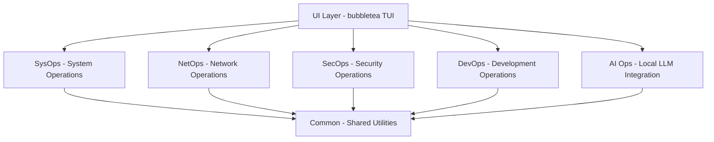
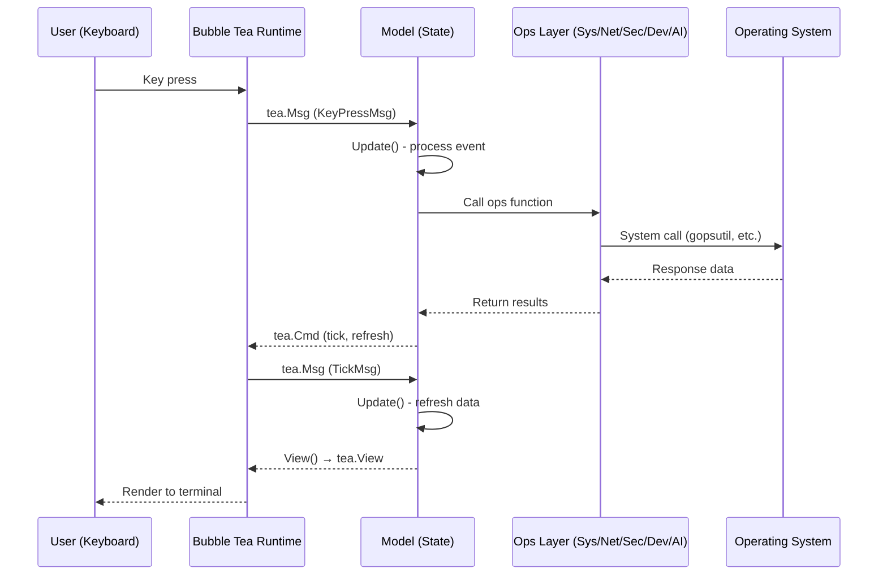
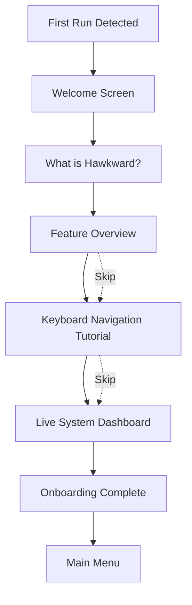

# Hawkward — Architecture Document

> A Go + Bubble Tea TUI Operations Platform covering SysOps, NetOps, SecOps, DevOps, and AI Ops.

---

## Table of Contents

1. [Overview](#overview)
2. [Layer Model](#layer-model)
3. [Tech Stack](#tech-stack)
4. [Component Tree](#component-tree)
5. [Data Flow](#data-flow)
6. [Directory Layout](#directory-layout)
7. [Key Decisions](#key-decisions)
8. [Onboarding Flow](#onboarding-flow)

---

## Overview

Hawkward is a keyboard-navigable terminal user interface (TUI) that provides system administrators, developers, and security professionals with a unified operations dashboard.

### Goals

- **Single binary** — No PowerShell, WMI, or external runtime dependencies
- **Guided onboarding** — First-time users get a walkthrough with zero terminal knowledge required
- **Layered operations** — SysOps (system info), NetOps (network diagnostics), SecOps (security auditing), DevOps (CI/process orchestration), AI Ops (local LLM integration)
- **Keyboard-first** — Full keyboard navigation, vim-style keybindings, accessible for power users
- **Live dashboards** — Auto-refreshing system health, network monitoring, security status
- **Professional reporting** — Rich, informative, visually appealing TUI output

### Non-Goals

- No web UI (terminal-only)
- No Docker dependency
- No cloud dependency (all local)
- Not a replacement for professional security scanners (e.g., Nessus, Wireshark)

---

## Layer Model

The application is organized into five operational layers that share a common UI framework:



### 1. SysOps (System Operations)
- CPU, RAM, disk, process monitoring
- System information (hostname, OS, kernel, uptime)
- Performance dashboards with real-time metrics
- Service status management

### 2. NetOps (Network Operations)
- Ping, traceroute, DNS lookup
- Port scanning
- Network interface monitoring (bandwidth, errors)
- Connection table (TCP/UDP)
- Live network graphs

### 3. SecOps (Security Operations)
- Local user/group audit
- Firewall rule viewer
- Windows Defender / security center status
- Listening ports with process attribution
- Scheduled task review

### 4. DevOps (Development Operations)
- Shell command execution
- Log tailing/filtering
- File system operations
- Process lifecycle management
- Service status monitoring

### 5. AI Ops (Local LLM Integration)
- Integration with local AI (Ollama, etc.)
- Natural language querying of system state
- Report generation from collected data

---

## Tech Stack

| Component | Library | Version | Purpose |
|-----------|---------|---------|---------|
| **TUI Framework** | `charm.land/bubbletea/v2` | v2.0.7 | Model-View-Update architecture |
| **UI Styling** | `charm.land/lipgloss/v2` | v2.x | Terminal styling, colors, layout |
| **UI Components** | `github.com/charmbracelet/bubbles` | latest | Key binding helpers |
| **System Metrics** | `github.com/shirou/gopsutil/v4` | v4.x | CPU, RAM, disk, processes, network |
| **Ping (ICMP)** | `golang.org/x/net/icmp` | latest | ICMP ping operations |
| **DNS** | `github.com/miekg/dns` | latest | DNS lookups |
| **Port Scanner** | `net.DialTimeout` | stdlib | TCP port scanning |
| **Shell Execution** | `os/exec` | stdlib | Running external commands |

---

## Component Tree

```mermaid
graph TD
    APP[App Root Model]
    MAINMENU[Main Menu - Category Selection]
    ONBOARDING[Onboarding Wizard]
    HELP[Help Overlay]
    
    APP --> MAINMENU
    APP --> ONBOARDING
    APP --> HELP
    
    MAINMENU --> SYSVIEW[SysOps Dashboard]
    MAINMENU --> NETVIEW[NetOps Dashboard]
    MAINMENU --> SECVIEW[SecOps Dashboard]
    MAINMENU --> DEVVIEW[DevOps Dashboard]
    MAINMENU --> AIVIEW[AI Ops Console]
    
    %% Sub-components per layer
    SYSVIEW --> CPU[CPU Panel]
    SYSVIEW --> MEM[Memory Panel]
    SYSVIEW --> DISK[Disk Panel]
    SYSVIEW --> PROC[Process Table]
    SYSVIEW --> SYSINFO[System Info Panel]
    
    NETVIEW --> PING[Ping Tool]
    NETVIEW --> TRACE[Traceroute]
    NETVIEW --> DNS[DNS Lookup]
    NETVIEW --> PORTSCAN[Port Scanner]
    NETVIEW --> CONNTRACK[Connection Table]
    NETVIEW --> NETGRAPH[Network Graph]
    
    SECVIEW --> FWRULE[Firewall Rules]
    SECVIEW --> USERS[User Audit]
    SECVIEW --> LISTEN[Listening Ports]
    SECVIEW --> DEFENDER[Defender Status]
    SECVIEW --> TASKS[Scheduled Tasks]
    
    DEVVIEW --> SHELL[Command Runner]
    DEVVIEW --> LOGTAIL[Log Tailer]
    DEVVIEW --> FILEBROWSER[File Browser]
    
    AIVIEW --> CHAT[AI Chat Panel]
    AIVIEW --> REPORT[Report Generator]
```



---

## Data Flow



### State Management Pattern

Each ops layer has its own model struct embedded in the root model:

```go
type RootModel struct {
    // Navigation
    activeScreen Screen
    previousScreen Screen
    
    // Layer models
    sysOps  *sysops.Model
    netOps  *netops.Model
    secOps  *secops.Model
    devOps  *devops.Model
    aiOps   *aiops.Model
    
    // Shared
    helpVisible bool
    width, height int
    statusMessage string
}
```

---

## Directory Layout

```
hawkward/
├── cmd/
│   └── hawkward/
│       └── main.go              # Entry point
├── internal/
├── internal/sysops/                   # System Operations layer
│   │   ├── collector.go          # Aggregate stats collection
│   │   ├── cpu.go                # CPU metrics (gopsutil)
│   │   ├── disk.go               # Disk metrics
│   │   ├── memory.go             # RAM metrics
│   │   ├── model.go              # SysOps model + update routing
│   │   ├── processes.go          # Process listing
│   │   ├── system.go             # Host info
│   │   ├── update.go             # Message handler
│   │   └── view.go               # Dashboard renderer
│   ├── netops/                   # Network Operations layer
│   │   ├── connections.go        # TCP/UDP connection table
│   │   ├── dns.go                # DNS lookup (miekg/dns)
│   │   ├── interfaces.go         # Network interfaces
│   │   ├── model.go              # NetOps model + update routing
│   │   ├── ping.go               # ICMP ping + ping.exe fallback
│   │   ├── portscan.go           # TCP port scanner
│   │   ├── update.go             # Message handler
│   │   └── view.go               # Dashboard renderer
│   ├── secops/                   # Security Operations layer
│   │   ├── defender.go           # Windows Defender status
│   │   ├── firewall.go           # Firewall rules (netsh)
│   │   ├── listening.go          # Listening ports (netstat)
│   │   ├── model.go              # SecOps model + update routing
│   │   ├── tasks.go              # Scheduled tasks
│   │   ├── update.go             # Message handler
│   │   ├── users.go              # User/group audit
│   │   └── view.go               # Dashboard renderer
│   ├── devops/                   # DevOps layer
│   │   ├── filebrowser.go        # File operations
│   │   ├── logtail.go            # Log tailing
│   │   ├── model.go              # DevOps model + update routing
│   │   ├── shell.go              # Command execution
│   │   ├── update.go             # Message handler
│   │   └── view.go               # Dashboard renderer
│   ├── aiops/                    # AI Ops layer
│   │   ├── model.go              # AIOps model + update routing
│   │   ├── ollama.go             # Ollama HTTP API integration
│   │   ├── reporting.go          # Report generation
│   │   ├── update.go             # Message handler
│   │   └── view.go               # Dashboard renderer
│   ├── ui/                       # Shared UI components
│   │   ├── root.go               # Root model, routing, navigation
│   │   ├── mainmenu.go           # Home screen with 5 categories
│   │   ├── help.go               # Help overlay
│   │   ├── statusbar.go          # Status bar with live health
│   │   ├── onboarding.go         # 5-step first-run wizard
│   │   ├── styles.go             # Lip Gloss styles & palette
│   │   └── keys.go               # Key binding definitions
│   └── common/                   # Shared utilities
│       ├── types.go              # Common types (Screen, MenuItem, SystemStats, TickMsg)
│       ├── formatters.go         # Data formatting (bytes, percent, uptime)
│       └── platform.go           # OS detection
├── pkg/                          # Public packages (if any)
├── docs/
│   ├── ARCHITECTURE.md           # This file
│   ├── STANDARDS.md              # Development standards
│   ├── ONBOARDING.md             # Onboarding design
│   └── ROADMAP.md                # Future plans
├── scripts/
│   ├── build.bat                 # Windows build script
│   └── build.sh                  # Unix build script
├── go.mod
├── go.sum
├── README.md
└── LICENSE
```

---

## Key Decisions

### Why Bubble Tea over ratatui (Rust)?

| Factor | Bubble Tea (Go) | ratatui (Rust) |
|--------|----------------|----------------|
| Cross-compilation | `GOOS=windows GOARCH=amd64 go build` | Need cross-compilation toolchain |
| Dependency management | `go mod tidy` | Cargo + sometimes complex builds |
| Learning curve | Moderate (Go is simple) | Steep (Rust ownership + lifetimes) |
| Windows support | First-class (gopsutil has full Windows support) | Good but some gaps |
| Community | 43k stars, 21k+ apps, widely adopted | 20k stars, strong ecosystem |

### Project Structure

We follow the [Standard Go Project Layout](https://github.com/golang-standards/project-layout) conventions:

- `cmd/` — Application entry points
- `internal/` — Private application code (not importable by external packages)
- `pkg/` — Public library code that could be reused externally

### State Management

Each ops layer is a self-contained Bubble Tea model that implements `tea.Model`. The root model delegates to the active layer's update/view methods. This keeps each layer independently testable.

### Windows-First, Cross-Platform Later

The architecture uses `gopsutil` which abstracts platform differences. Platform-specific code lives in files with `_windows.go`, `_linux.go`, `_darwin.go` suffixes.

### Security

- All data collection is local — no data leaves the machine
- No hardcoded credentials or secrets
- Command execution in DevOps layer requires explicit user confirmation
- WhatIf mode available for destructive operations

---

## Onboarding Flow



Returning users see the main menu directly with a status bar showing system health at a glance.

---

*Last updated: 2026-07-01*
*Next review: Architecture must be updated when adding new ops layers.*
