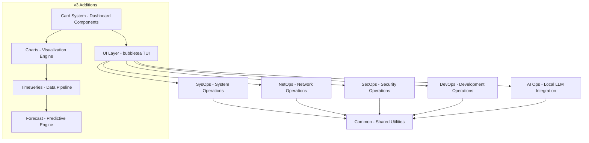
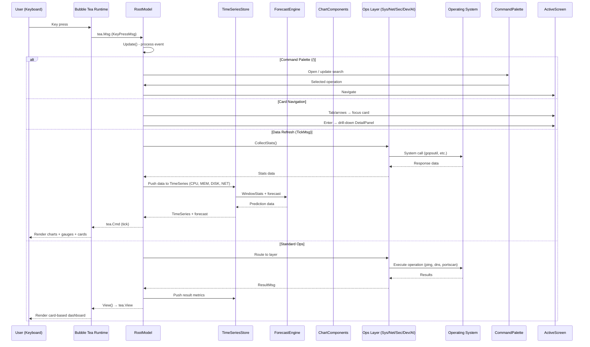
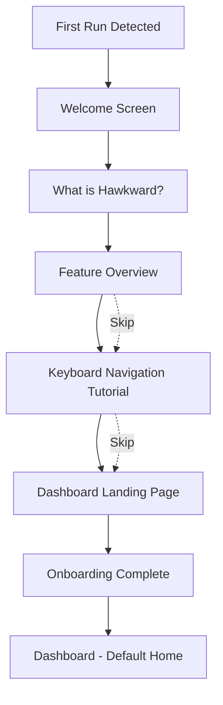

# Hawkward — Architecture Document

> A Go + Bubble Tea TUI Operations Platform covering SysOps, NetOps, SecOps, DevOps, and AI Ops.

---

## Table of Contents

1. [Overview](#overview)
2. [Layer Model](#layer-model)
3. [Tech Stack](#tech-stack)
4. [Component Tree](#component-tree)
5. [Data Flow](#data-flow)
6. [Directory Layout](#directory-layout)
7. [v3 Changes](#v3-changes)
8. [Key Decisions](#key-decisions)
9. [Onboarding Flow](#onboarding-flow)

---

## Overview

Hawkward is a keyboard-navigable terminal user interface (TUI) that provides system administrators, developers, and security professionals with a unified operations dashboard.

### Goals

- **Single binary** — No PowerShell, WMI, or external runtime dependencies
- **Guided onboarding** — First-time users get a walkthrough with zero terminal knowledge required
- **Layered operations** — SysOps (system info), NetOps (network diagnostics), SecOps (security auditing), DevOps (CI/process orchestration), AI Ops (local LLM integration)
- **Keyboard-first** — Full keyboard navigation, vim-style keybindings, accessible for power users
- **Live dashboards** — Auto-refreshing system health, network monitoring, security status
- **Professional reporting** — Rich, informative, visually appealing TUI output
- **v3: Interactive visual dashboards** — Card-based layouts, real-time charts, forecasting, global command palette

### Non-Goals

- No web UI (terminal-only)
- No Docker dependency
- No cloud dependency (all local)
- Not a replacement for professional security scanners (e.g., Nessus, Wireshark)

---

## Layer Model

The application is organized into five operational layers that share a common UI framework:



### 1. SysOps (System Operations)
- CPU, RAM, disk, process monitoring
- System information (hostname, OS, kernel, uptime)
- Performance dashboards with real-time metrics
- Service status management
- **v3**: Gauge cards with sparklines, CPU core breakdown bar chart, memory stacked bar, process drill-down

### 2. NetOps (Network Operations)
- Ping, traceroute, DNS lookup
- Port scanning
- Network interface monitoring (bandwidth, errors)
- Connection table (TCP/UDP)
- Live network graphs
- **v3**: Latency line chart, throughput RX/TX chart, port density heat map, per-hop latency bar chart

### 3. SecOps (Security Operations)
- Local user/group audit
- Firewall rule viewer
- Windows Defender / security center status
- Listening ports with process attribution
- Scheduled task review
- **v3**: Firewall rule cards with allow/deny badges, port heat map by risk, defender status gauge

### 4. DevOps (Development Operations)
- Shell command execution
- Log tailing/filtering
- File system operations
- Process lifecycle management
- Service status monitoring
- **v3**: Shell session status cards, log tail with search highlights

### 5. AI Ops (Local LLM Integration)
- Integration with local AI (Ollama, etc.)
- Natural language querying of system state
- Report generation from collected data
- **v3**: System summarization, trend explanation, forecast narrative, recommended actions

---

## Tech Stack

| Component | Library | Version | Purpose |
|-----------|---------|---------|---------|
| **TUI Framework** | `charm.land/bubbletea/v2` | v2.0.7 | Model-View-Update architecture |
| **UI Styling** | `charm.land/lipgloss/v2` | v2.x | Terminal styling, colors, layout |
| **UI Components** | `github.com/charmbracelet/bubbles` | latest | Key binding helpers |
| **System Metrics** | `github.com/shirou/gopsutil/v4` | v4.x | CPU, RAM, disk, processes, network |
| **Ping (ICMP)** | `golang.org/x/net/icmp` | latest | ICMP ping operations |
| **DNS** | `github.com/miekg/dns` | latest | DNS lookups |
| **Port Scanner** | `net.DialTimeout` | stdlib | TCP port scanning |
| **Shell Execution** | `os/exec` | stdlib | Running external commands |
| **Chart Rendering** | None — Unicode braille + block chars | built-in | Pure Lip Gloss + Unicode visualization |

---

## Component Tree

```mermaid
graph TD
    APP[App Root Model]
    DASHBOARD[Dashboard Landing Page]
    MAINMENU[Main Menu - Secondary Nav]
    ONBOARDING[Onboarding Wizard]
    HELP[Help Overlay]
    COMMAND_PALETTE[Command Palette]
    CARDS[Card Component System]
    CHARTS[Chart Library]
    
    APP --> DASHBOARD
    APP --> ONBOARDING
    APP --> HELP
    APP --> COMMAND_PALETTE
    DASHBOARD --> MAINMENU
    
    DASHBOARD --> SYSVIEW[SysOps Dashboard]
    DASHBOARD --> NETVIEW[NetOps Dashboard]
    DASHBOARD --> SECVIEW[SecOps Dashboard]
    DASHBOARD --> DEVVIEW[DevOps Dashboard]
    DASHBOARD --> AIVIEW[AI Ops Console]
    
    subgraph "Card Components"
        CARDS --> GAUGE_CARD[GaugeCard]
        CARDS --> CHART_CARD[ChartCard]
        CARDS --> TABLE_CARD[TableCard]
        CARDS --> STATUS_CARD[StatusCard]
        CARDS --> DETAIL_PANEL[DetailPanel]
        CARDS --> SPLIT_PANE[SplitPane]
    end
    
    subgraph "Chart Components"
        CHARTS --> LINE_CHART[LineChart]
        CHARTS --> BAR_CHART[BarChart]
        CHARTS --> GAUGE[Gauge]
        CHARTS --> SPARKLINE[Sparkline v2]
        CHARTS --> HEATMAP[HeatMap]
        CHARTS --> NUMERIC[NumericDisplay]
    end
    
    GAUGE_CARD --> GAUGE
    CHART_CARD --> LINE_CHART
    CHART_CARD --> BAR_CHART
    STATUS_CARD --> SPARKLINE
    
    SYSVIEW --> CARDS
    SYSVIEW --> CHARTS
    NETVIEW --> CARDS
    NETVIEW --> CHARTS
    SECVIEW --> CARDS
    SECVIEW --> CHARTS
    DEVVIEW --> CARDS
    AIVIEW --> CARDS
    
    MAINMENU --> SYSVIEW
    MAINMENU --> NETVIEW
    MAINMENU --> SECVIEW
    MAINMENU --> DEVVIEW
    MAINMENU --> AIVIEW
    
    %% Sub-components per layer (v3 card-based)
    SYSVIEW --> CPU_G[CPU GaugeCard]
    SYSVIEW --> MEM_G[Memory GaugeCard]
    SYSVIEW --> DISK_G[Disk GaugeCard]
    SYSVIEW --> PROC_T[Process TableCard]
    SYSVIEW --> SYSINFO[System Info Card]
    
    NETVIEW --> PING_C[Ping Latency ChartCard]
    NETVIEW --> DNS_C[DNS StatusCard]
    NETVIEW --> PORTSCAN_C[Port Scan Progress + TableCard]
    NETVIEW --> CONNTRACK_C[Connection TableCard]
    NETVIEW --> TRACE_C[Traceroute BarChart Card]
    NETVIEW --> THROUGHPUT_C[Throughput ChartCard]
    
    SECVIEW --> FWRULE_C[Firewall Rule Cards]
    SECVIEW --> USERS_C[User TableCard]
    SECVIEW --> LISTEN_C[Port HeatMap + TableCard]
    SECVIEW --> DEFENDER_C[Defender GaugeCard]
    SECVIEW --> TASKS_C[Task StatusCards]
```



**Key v3 changes from previous architecture**:
- `Dashboard` replaces `MainMenu` as the root-level default (`ScreenDashboard` in `common.Screen` enum)
- All ops layers now render via `CardGrid` with specialized card types instead of tab-based text panels
- `CommandPalette` is accessible from any screen via `/`
- Chart library is a shared dependency used by all card types
- `DetailPanel` provides drill-down without leaving the current view

---

## Data Flow



### State Management Pattern (v3)

```go
type RootModel struct {
    // Navigation
    activeScreen     common.Screen
    previousScreens  []common.Screen
    
    // v3: Dashboard
    dashboard        *ui.DashboardModel
    
    // v3: Cmd Palette
    commandPalette   *ui.CommandPaletteModel
    
    // v3: Time-series store
    timeSeriesStore  *common.TimeSeriesStore
    
    // Layer models (unchanged)
    sysOps  *sysops.Model
    netOps  *netops.Model
    secOps  *secops.Model
    devOps  *devops.Model
    aiOps   *aiops.Model
    
    // Shared
    helpVisible      bool
    width, height    int
    statusMessage    string
    keys             KeyMap
    stats            *common.SystemStats
    refreshInterval  time.Duration
}
```

---

## Directory Layout

```
hawkward/
├── cmd/
│   └── hawkward/
│       └── main.go              # Entry point
├── internal/
│   ├── common/                   # Shared utilities
│   │   ├── charts/               # v3: Chart library (new)
│   │   │   ├── config.go         # ChartConfig, shared constants
│   │   │   ├── line.go           # LineChart (braille-based)
│   │   │   ├── bar.go            # BarChart (block-based)
│   │   │   ├── area.go           # AreaChart (braille + fill)
│   │   │   ├── gauge.go          # Gauge (block, horiz/vert)
│   │   │   ├── sparkline.go      # Sparkline v2 (enhanced)
│   │   │   ├── heatmap.go        # HeatMap (density grid)
│   │   │   ├── number.go         # NumericDisplay (large digits)
│   │   │   └── chart_test.go     # Chart tests
│   │   ├── timeseries.go         # v3: Ring buffer + TimeSeriesStore
│   │   ├── forecast.go           # v3: Linear reg., smoothing, trend
│   │   ├── alerts.go             # v3: Alert/incident types, flap detection
│   │   ├── config.go             # v3: YAML config load/save
│   │   ├── types.go              # Screen, SystemStats, TickMsg
│   │   ├── styles.go             # PanelTitle, Value, Label, etc.
│   │   ├── theme.go              # Palette, 10 themes
│   │   ├── formatters.go         # Data formatting
│   │   ├── logger.go             # Logging with rotation
│   │   ├── platform.go           # OS detection
│   │   └── sandbox*.go           # Sandboxed execution
│   ├── sysops/                   # System Operations
│   │   ├── collector.go, cpu.go, disk.go, memory.go, processes.go, system.go
│   │   ├── model.go, update.go, view.go, workflows.go
│   ├── netops/                   # Network Operations
│   │   ├── connections.go, dns.go, interfaces.go, ping.go, portscan.go
│   │   ├── model.go, update.go, view.go, workflows.go
│   ├── secops/                   # Security Operations
│   │   ├── defender.go, firewall.go, listening.go, tasks.go, users.go
│   │   ├── model.go, update.go, view.go, workflows.go
│   ├── devops/                   # Development Operations
│   │   ├── filebrowser.go, logtail.go, shell.go
│   │   ├── model.go, update.go, view.go, workflows.go
│   ├── aiops/                    # AI Operations (Ollama)
│   │   ├── ollama.go, reporting.go
│   │   ├── model.go, update.go, view.go, workflows.go
│   └── ui/                       # TUI layer
│       ├── root.go               # RootModel, routing, navigation
│       ├── dashboard.go          # v3: Dashboard landing page
│       ├── cards.go              # v3: Card system (CardGrid, GaugeCard, etc.)
│       ├── commandpalette.go     # v3: Global command palette
│       ├── alertview.go          # v3: Alert timeline view
│       ├── settings.go           # v3: In-app settings editor
│       ├── logviewer.go          # v3: Session log viewer
│       ├── mainmenu.go           # Main menu (secondary in v3)
│       ├── help.go               # Help overlay
│       ├── statusbar.go          # Status bar with live health
│       ├── onboarding.go         # 5-step first-run wizard
│       ├── styles.go             # Lip Gloss styles & palette
│       └── keys.go               # Key binding definitions
├── pkg/                          # Public packages (if any)
├── docs/
│   ├── ARCHITECTURE.md           # This file
│   ├── STANDARDS.md              # Development standards
│   ├── ONBOARDING.md             # Onboarding design
│   └── ROADMAP.md                # Future plans
├── plans/                        # Overhaul plans
│   ├── overhaul-v3-summary.md    # Executive summary
│   └── ...
├── scripts/
│   ├── build.bat                 # Windows build script
│   └── build.sh                  # Unix build script
├── go.mod
├── go.sum
├── README.md
└── LICENSE
```

---

## Key Decisions

### Why Bubble Tea over ratatui (Rust)?

| Factor | Bubble Tea (Go) | ratatui (Rust) |
|--------|----------------|----------------|
| Cross-compilation | `GOOS=windows GOARCH=amd64 go build` | Need cross-compilation toolchain |
| Dependency management | `go mod tidy` | Cargo + sometimes complex builds |
| Learning curve | Moderate (Go is simple) | Steep (Rust ownership + lifetimes) |
| Windows support | First-class (gopsutil has full Windows support) | Good but some gaps |
| Community | 43k stars, 21k+ apps, widely adopted | 20k stars, strong ecosystem |

### Project Structure

We follow the [Standard Go Project Layout](https://github.com/golang-standards/project-layout) conventions:

- `cmd/` — Application entry points
- `internal/` — Private application code (not importable by external packages)
- `pkg/` — Public library code that could be reused externally

### v3: Why Charts Use Unicode Instead of a Library

- **Single binary constraint** — No cairo, ncurses, or font rendering dependencies
- **Terminal-native** — Braille and block characters work in every terminal emulator
- **Theme-aware** — All chart colors use `common.Palette` for consistent dark/light/high-contrast theming
- **Composable** — Charts return `lipgloss.Style`-compatible strings embeddable in cards, panels, or standalone

### v3: Card-Based Architecture

Instead of tabs with text panels, each ops layer now uses:
- **CardGrid** — Responsive grid that auto-columns based on terminal width
- **Card focus** — Tab/shift-tab navigates between cards; focused card shows highlighted border
- **Drill-down** — Enter on any card opens a `DetailPanel` overlay without leaving the current view

### v3: Dashboard as the New Home

The dashboard landing page replaces the main menu as the default home screen:
- Shows system health at a glance with CPU/MEM/DISK gauges
- Shows operation category cards with sparklines and live counts
- Shows active alerts and anomalies
- Provides quick-jump to any ops layer

### State Management

Each ops layer is a self-contained Bubble Tea model that implements `tea.Model`. The root model delegates to the active layer's update/view methods. In v3, the root model also manages the time-series store, dashboard, and command palette.

### Windows-First, Cross-Platform Later

The architecture uses `gopsutil` which abstracts platform differences. Platform-specific code lives in files with `_windows.go`, `_linux.go`, `_darwin.go` suffixes.

### Security

- All data collection is local — no data leaves the machine
- No hardcoded credentials or secrets
- Command execution in DevOps layer requires explicit user confirmation
- WhatIf mode available for destructive operations

---

## Onboarding Flow



Returning users see the **dashboard landing page** directly with live health gauges, operation cards, and status bar.

---

## v3 Card System API Reference

### Card Types

| Type | Struct | File | Purpose |
|------|--------|------|---------|
| **Base Card** | `Card` | `internal/ui/cards.go` | Title, body, footer, status, focus |
| **GaugeCard** | Wraps `Card` + `charts.Gauge` | `internal/ui/cards.go` | Health metrics (CPU, MEM, DISK) |
| **ChartCard** | Wraps `Card` + chart component | `internal/ui/cards.go` | Line/bar/area charts |
| **TableCard** | Wraps `Card` + sortable table | `internal/ui/cards.go` | Process list, connections |
| **StatusCard** | Compact icon + value + sparkline | `internal/ui/cards.go` | Quick status overview |
| **DetailPanel** | Overlay layer | `internal/ui/cards.go` | Drill-down details |
| **SplitPane** | Resizable split | `internal/ui/cards.go` | Side-by-side views |

### Chart Types

| Component | File | Unicode | Best For |
|-----------|------|---------|----------|
| `LineChart` | `charts/line.go` | Braille ⣀⣤⣶⣿ | Time-series trends |
| `BarChart` | `charts/bar.go` | Block ▁▂▃▄▅▆▇█ | Comparisons |
| `AreaChart` | `charts/area.go` | Braille + fill | Stacked trends |
| `Gauge` | `charts/gauge.go` | Block ▓▒░ | Health indicators |
| `Sparkline` | `charts/sparkline.go` | Block | Compact trends |
| `HeatMap` | `charts/heatmap.go` | Colored ▪ | Density grids |
| `NumericDisplay` | `charts/number.go` | Large digits | Key metrics |

---

*Last updated: 2026-07-07*
*Next review: After v3 Sprint 2 delivery*
