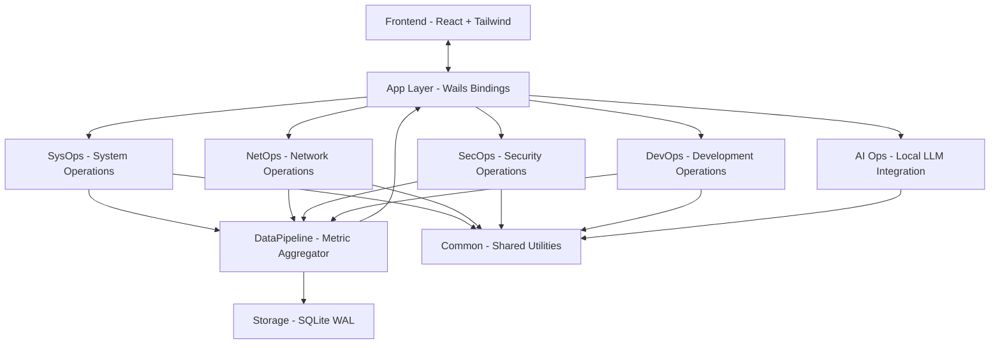
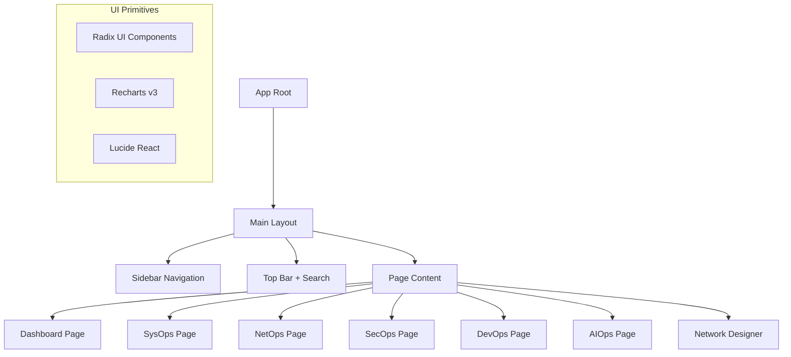
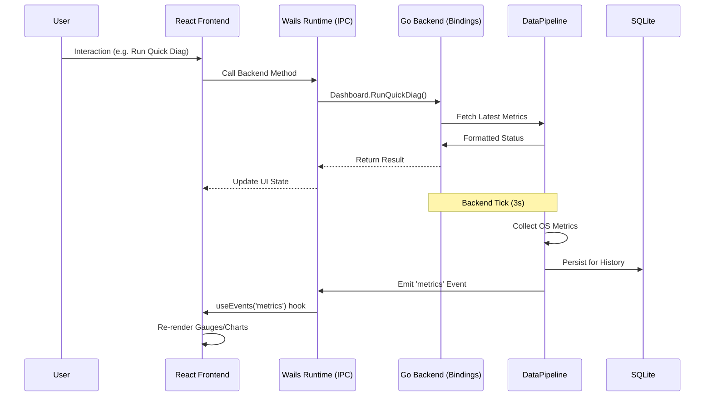

# OpsForAll — Architecture Document

> A native desktop operations platform built with Go and Wails v2, featuring a React + Tailwind GUI. Inspired by heroic "One For All" principles.

---

## Table of Contents

1. [Overview](#overview)
2. [Layer Model](#layer-model)
3. [Tech Stack](#tech-stack)
4. [Component Tree](#component-tree)
5. [Data Flow](#data-flow)
6. [Directory Layout](#directory-layout)
7. [Architecture Patterns](#architecture-patterns)
8. [Key Decisions](#key-decisions)

---

## Overview

OpsForAll
 is a premium native desktop application that provides system administrators, developers, and security professionals with a unified operations dashboard. It leverages the Wails framework to combine Go's performance and system access with the flexibility of a modern React frontend.

### Goals

- **Single binary** — Embedded frontend assets; no external runtime dependencies.
- **Native GUI** — Smooth, high-performance interface with real-time data visualization.
- **Layered operations** — SysOps (system info), NetOps (network diagnostics), SecOps (security auditing), DevOps (CI/process orchestration), AI Ops (local LLM integration).
- **Live dashboards** — Event-driven updates for system health, network monitoring, and security status.
- **Professional reporting** — Rich, exportable reports generated via local AI analysis.
- **Accessible Design** — Squib-inspired dark theme using Tailwind v4 and Radix UI primitives.

### Non-Goals

- Not a cloud-hosted SaaS (all data stays local).
- Not a replacement for professional deep-packet inspection (e.g., Wireshark).

---

## Layer Model

The application is organized into specialized domain packages (Go) bound to a unified React frontend via Wails:



### 1. SysOps (System Operations)
- CPU, RAM, disk, process monitoring.
- Real-time KPI cards with sparklines and per-core breakdown.

### 2. NetOps (Network Operations)
- Continuous ICMP ping, DNS lookup (A/MX/TXT/etc.), port scanning.
- Interactive network topology designer with save/load capability.

### 3. SecOps (Security Operations)
- Firewall rule management, user audit, listening ports.
- Windows Defender status and security event monitoring.

### 4. DevOps (Development Operations)
- Integrated terminal with command protection, Windows service management.
- File browser with preview and PowerShell workflow runner.

### 5. AI Ops (Local LLM Integration)
- Integration with local AI (Ollama) for system summarization and report generation.

---

## Tech Stack

| Component | Library | Purpose |
|-----------|---------|---------|
| **GUI Framework** | `wails.io/v2` | Native binary with embedded WebView |
| **Frontend** | React 19 + TypeScript | UI Logic |
| **Styling** | Tailwind v4 + Radix UI | Design System & Primitives |
| **State Management**| Zustand v5 | Client-side store |
| **Data Fetching** | TanStack Query v5 | Backend binding synchronization |
| **System Metrics** | `gopsutil/v4` | Low-level OS instrumentation |
| **Database** | `modernc.org/sqlite` | Embedded persistence (WAL mode) |
| **AI Integration** | `ollama/ollama/api` | Local LLM communication |
| **Logging** | `rs/zerolog` | Structured back-end logging |

---

## Component Tree (Frontend)



---

## Data Flow



---

## Directory Layout

```
AllOpsFull/
├── main.go                    # Wails entry point (//go:embed frontend)
├── internal/
│   ├── app/                   # Wails bindings (Dashboard, SysOps, NetOps, etc.)
│   ├── common/                # Shared: Pipeline, Storage, Alerts, Sandbox, Types
│   ├── sysops/                # CPU, Memory, Disk, Process monitoring
│   ├── netops/                # Ping, DNS, PortScan, Traceroute, Connections
│   ├── secops/                # Firewall, Defender, Users, Events
│   ├── devops/                # Shell, FileBrowser, Services
│   └── aiops/                 # Ollama client, Report generation
├── cmd/opsforall-gui/frontend/ # React + TypeScript + Vite frontend
│   ├── src/
│   │   ├── components/        # Layout, UI components, Overlays
│   │   ├── pages/             # Domain-specific views
│   │   ├── stores/            # Zustand stores (Settings, Ollama)
│   │   ├── hooks/             # useBackend, useEvents, useQuery
│   │   └── styles/            # Tailwind v4 globals
├── docs/                      # Documentation
├── scripts/                   # Platform-specific build scripts
└── .github/workflows/         # CI/CD: test.yml, release.yml
```

---

## Architecture Patterns

### 1. Wails Bindings
Backend logic is exposed to the frontend via structs in `internal/app/`. Wails automatically generates TypeScript definitions for these methods, ensuring type safety across the IPC boundary.

### 2. The Data Pipeline
A centralized Go ticker (`Pipeline`) collects system metrics every 3 seconds. This data is:
1. Pushed to a SQLite database for historical analysis.
2. Emitted as a Wails event to all frontend listeners.

### 3. Event-Driven UI
The frontend uses a custom `useEvents` hook to listen for backend ticks. This allows the Dashboard to update in real-time without expensive polling.

### 4. Settings Persistence
Settings (refresh intervals, themes, etc.) are managed in a Zustand store and synchronized with the backend via a dedicated `UpdateSettings` binding.

---

## Key Decisions

### Why Wails v2 + React?
Compared to heavy Electron apps:
- **Low Footprint**: Uses the native OS WebView (WebView2 on Windows) instead of bundling Chromium.
- **Go Power**: Direct access to system APIs, networking, and high-performance concurrency.
- **Modern UI**: Full CSS/JS ecosystem for complex charts (Recharts) and accessible interactions (Radix).

### Why SQLite with WAL Mode?
To handle frequent metric writes from the `DataPipeline` without blocking read queries from the UI, we use **Write-Ahead Logging (WAL)**.

### Why Local-First AI?
OpsForAll
 integrates with **Ollama** locally. This ensures that sensitive system architecture and logs never leave the user's machine, satisfying enterprise privacy requirements.

---

*Last updated: 2026-07-12*
