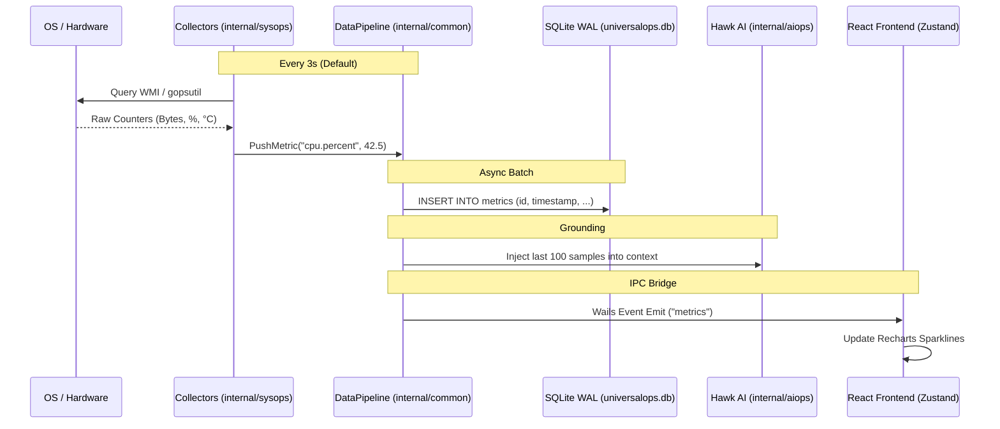
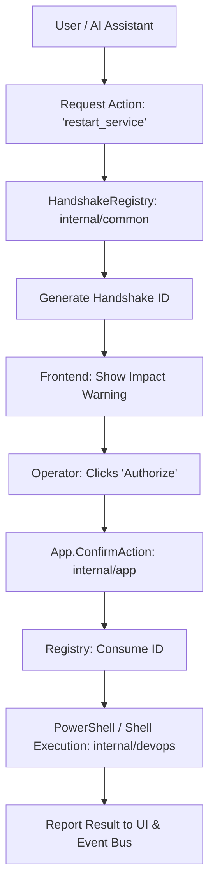

# UniversalOps — Code Connections & Data Flow

This document plots the lifecycle of telemetry and commands across the application layers.

---

## 1. The Telemetry Pipeline (Inbound)

Data flows from the hardware to the UI in a decoupled, asynchronous loop.

### Key Connections:
- **Collector -> Pipeline**: Occurs in `internal/app/collectors.go`.
- **Pipeline -> DB**: Unified in `internal/common/storage.go` via `writerLoop`.
- **Pipeline -> AI**: Handled in `internal/app/AIOps.go` during prompt construction.

---

## 2. The Execution Handshake (Outbound)

State-changing commands follow a strict safety protocol to prevent unauthorized or accidental impact.

### Key Connections:
- **UI -> Registry**: Actions are "staged" first using `Registry.Register`.
- **Operator -> Backend**: `ConfirmAction` is the only entry point for execution.
- **Backend -> Shell**: Regulated by the **Token-based Sanitizer** in `internal/devops/shell.go`.

---

## 3. Layer Responsibilities

| Layer | Responsibility | Primary Files |
| :--- | :--- | :--- |
| **Substrate** | Direct OS/Hardware Probing | `internal/sysops/*.go` |
| **Common** | Core logic, Persistence, Sandboxing | `internal/common/*.go` |
| **App** | Facades, Wails Bindings, Orchestration | `internal/app/*.go` |
| **Intelligence** | Synthesis, RCA, Natural Language | `internal/aiops/*.go` |
| **GUI** | Visualization, Shadow State, User Intent | `cmd/opsforall-gui/frontend/src/` |

---

## 4. Cross-Layer Dependency Map

- **internal/app** depends on **internal/sysops**, **internal/netops**, **internal/secops**, **internal/aiops**, and **internal/common**.
- **internal/aiops** depends on **internal/common** (for knowledge/storage).
- **internal/common** has **ZERO** dependencies on other `internal/` packages (Core Layer).
- **cmd/opsforall-gui** depends exclusively on the bindings generated from **internal/app**.

*Generated: 2026-07-21*
