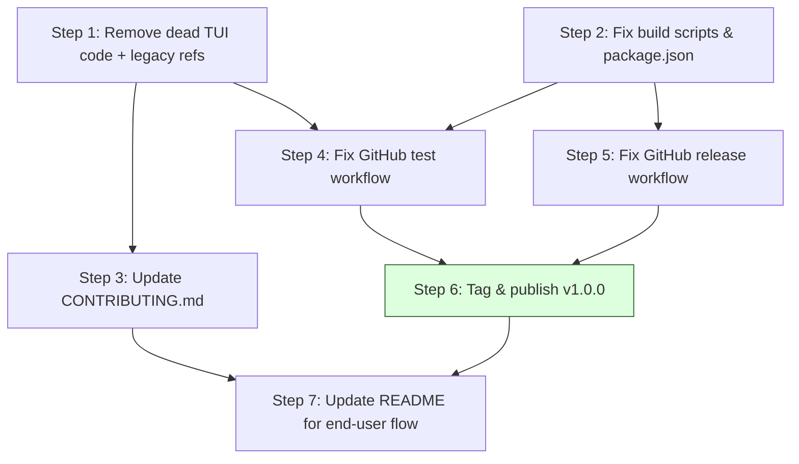

# Plan: Release Pipeline — One-Click Download & Run

**Objective**: Deliver pre-built binaries on GitHub Releases so anyone can download and run Hawkward with zero programming skills. No Go, no Node, no terminal.

## Dependency Graph



| Step | Parallelizable? | Write Surface | Risk | Verification |
|------|----------------|---------------|------|-------------|
| S-01 | Parallel with S-02 | legacy/tui, cmd/hawkward, .memory | Low | `go build`, `go test` |
| S-02 | Parallel with S-01 | scripts/*, package.json | Low | `npm run build` |
| S-03 | After S-01 | CONTRIBUTING.md | Low | Visual review |
| S-04 | After S-01, S-02 | .github/workflows/test.yml | Low | PR check passes |
| S-05 | After S-02 | .github/workflows/release.yml | Medium | Dry-run with `act` |
| S-06 | After S-04, S-05 | git tag, GitHub Release | Low | Release page visible |
| S-07 | After S-06 | README.md | Low | Visual review |

---

## Steps

### Step 1: Remove Dead TUI Code & Legacy References

**Context:** The old TUI (terminal UI) code was moved to `legacy/tui/` during the GUI overhaul but never removed. The `cmd/hawkward/` directory is empty. Both are dead weight and confuse anyone reading the repo.

**Files:**
- `legacy/tui/` (entire directory, 4,840 lines, 13 files)
- `cmd/hawkward/` (empty directory)
- `.memory/index.md` (references to TUI architecture)

**Tasks:**
1. Remove `legacy/tui/` directory entirely
2. Remove empty `cmd/hawkward/` directory
3. Update `.memory/index.md` to remove TUI architecture references
4. Verify `go build .` passes (root main.go is the Wails entry point)
5. Verify `go test ./internal/...` passes

**Verification:**
```bash
go build .
go vet ./...
go test ./internal/... -count=1
```

**Exit criteria:**
- `legacy/tui/` gone
- `cmd/hawkward/` gone
- All Go tests pass
- `staticcheck ./...` returns 0

---

### Step 2: Fix Build Scripts & Package.json

**Context:** All build scripts target the old TUI entry point `./cmd/hawkward/` with `go build`. The correct build command for the Wails GUI is `wails build`. Also, `package.json` is missing a `test` script that the frontend tests need.

**Files:**
- `scripts/build.bat`
- `scripts/build.sh`
- `scripts/release.ps1`
- `scripts/release-gh.sh`
- `cmd/hawkward-gui/frontend/package.json`

**Tasks:**
1. **`scripts/build.bat`** — Replace `go build -o hawkward.exe .\cmd\hawkward\` with:
   ```bat
   @echo off
   echo Building Hawkward GUI...
   wails build -o hawkward-gui.exe
   if %ERRORLEVEL% EQU 0 (
       echo Build successful: build/bin/hawkward-gui.exe
   ) else (
       echo Build failed
       exit /b %ERRORLEVEL%
   )
   ```

2. **`scripts/build.sh`** — Same fix, use `wails build` instead of `go build`:
   ```bash
   #!/bin/bash
   set -e
   echo "Building Hawkward GUI..."
   wails build -o hawkward-gui
   echo "Build successful: build/bin/hawkward-gui"
   ```

3. **`scripts/release.ps1`** — Replace all `go build ... .\cmd\hawkward\` references with `wails build`. Each platform builds natively since Wails requires platform-specific CGO/webview2 libs:
   ```powershell
   $targets = @(
       @{ GOOS = "windows"; GOARCH = "amd64"; Platform = "windows/amd64"; Ext = ".exe" },
       @{ GOOS = "linux";   GOARCH = "amd64"; Platform = "linux/amd64";    Ext = "" },
       @{ GOOS = "darwin";  GOARCH = "amd64"; Platform = "darwin/amd64";   Ext = "" },
       @{ GOOS = "darwin";  GOARCH = "arm64"; Platform = "darwin/arm64";   Ext = "" }
   )
   foreach ($target in $targets) {
       $name = "hawkward-$Version-$($target.GOOS)-$($target.GOARCH)$($target.Ext)"
       $path = Join-Path $OutputDir $name
       $env:GOOS = $null
       $env:GOARCH = $null  # wails build handles this via -platform
       wails build -platform $target.Platform -o $path
   }
   ```
   Or better: add `-nsis` for Windows builds to generate an installer:
   ```powershell
   wails build -platform windows/amd64 -nsis -o hawkward-$Version-windows-amd64
   ```

4. **`scripts/release-gh.sh`** — Same fix, use `wails build -platform` for each target:
   ```bash
   wails build -platform windows/amd64 -o hawkward-windows-amd64.exe
   wails build -platform linux/amd64 -o hawkward-linux-amd64
   wails build -platform darwin/amd64 -o hawkward-darwin-amd64
   wails build -platform darwin/arm64 -o hawkward-darwin-arm64
   ```

5. **`package.json`** — Add test script:
   ```json
   "scripts": {
     "dev": "vite",
     "build": "tsc -b && vite build",
     "test": "vitest run",
     "lint": "eslint .",
     "preview": "vite preview"
   }
   ```

**Verification:**
```bash
cd cmd/hawkward-gui/frontend && npm test   # must pass
wails build -dryrun                        # must show correct command
```

**Exit criteria:**
- `package.json` has `"test": "vitest run"` script
- Build scripts reference `wails build`
- No remaining references to `./cmd/hawkward` in scripts

---

### Step 3: Update CONTRIBUTING.md

**Context:** The contributing guide still references the old TUI architecture (Bubble Tea, Lip Gloss, `internal/ui/`, `go build ./cmd/hawkward`). It needs to describe the Wails GUI architecture instead.

**Files:**
- `CONTRIBUTING.md`

**Tasks:**
1. Replace old TUI build instructions with Wails GUI instructions:
   - Prerequisites: Go 1.26+, Node.js, npm, Wails CLI
   - `wails dev` for development (hot-reload)
   - `wails build` for production
   - `go test ./internal/...` for backend tests
   - `cd cmd/hawkward-gui/frontend && npm test` for frontend tests
2. Remove references to Bubble Tea, Lip Gloss patterns
3. Update project structure section to reflect current layout
4. Remove `internal/ui/` reference (no longer exists)

**Verification:** Visual review of the file.

**Exit criteria:** CONTRIBUTING.md accurately describes the Wails GUI architecture.

---

### Step 4: Fix GitHub Test Workflow

**Context:** The test workflow only runs Go tests. It doesn't install the frontend dependencies or run frontend tests. It also should use `go build .` (root entry point) not `go build ./cmd/hawkward`.

**Files:**
- `.github/workflows/test.yml`

**Tasks:**
1. Remove matrix entirely (a single ubuntu-latest runner is sufficient for tests)
2. Add Node.js setup step
3. Install frontend deps: `cd cmd/hawkward-gui/frontend && npm ci`
4. Run backend tests: `go test ./internal/... -count=1`
5. Run frontend tests: `cd cmd/hawkward-gui/frontend && npm test`
6. Run TypeScript check: `cd cmd/hawkward-gui/frontend && npx tsc --noEmit`
7. Run linter: `cd cmd/hawkward-gui/frontend && npm run lint`

```yaml
name: Test

on:
  push:
    branches: [main, develop]
  pull_request:
    branches: [main]

jobs:
  test:
    runs-on: ubuntu-latest
    steps:
      - uses: actions/checkout@v4
      - name: Set up Go
        uses: actions/setup-go@v5
        with:
          go-version: '1.26'
      - name: Set up Node
        uses: actions/setup-node@v4
        with:
          node-version: '22'
          cache: 'npm'
          cache-dependency-path: cmd/hawkward-gui/frontend/package-lock.json
      - name: Install frontend dependencies
        run: cd cmd/hawkward-gui/frontend && npm ci
      - name: Vet
        run: go vet ./...
      - name: Go test
        run: go test ./internal/... -count=1
      - name: TypeScript check
        run: cd cmd/hawkward-gui/frontend && npx tsc --noEmit
      - name: Frontend test
        run: cd cmd/hawkward-gui/frontend && npm test
      - name: Lint
        run: cd cmd/hawkward-gui/frontend && npm run lint
```

**Verification:** Push to a test branch, the CI check must pass.

**Exit criteria:** All test, vet, lint, and TypeScript checks pass in CI.

---

### Step 5: Fix GitHub Release Workflow

**Context:** The release workflow tries `go build ./cmd/hawkward` which doesn't exist. It must use `wails build` with a matrix of native runners. This is the **core of the one-click download goal**.

**Files:**
- `.github/workflows/release.yml`

**Tasks:**
1. Replace the single `ubuntu-latest` job with a **matrix build across all 3 platforms**
2. Each platform builds its native binary using `wails build`
3. Windows job also creates an NSIS installer (`-nsis` flag)
4. Upload all artifacts to GitHub Release

```yaml
name: Release

on:
  push:
    tags:
      - 'v*'

jobs:
  build-windows:
    runs-on: windows-latest
    steps:
      - uses: actions/checkout@v4
      - name: Set up Go
        uses: actions/setup-go@v5
        with:
          go-version: '1.26'
      - name: Set up Node
        uses: actions/setup-node@v4
        with:
          node-version: '22'
          cache: 'npm'
          cache-dependency-path: cmd/hawkward-gui/frontend/package-lock.json
      - name: Install Wails CLI
        run: go install github.com/wailsapp/wails/v2/cmd/wails@latest
      - name: Install frontend dependencies
        run: cd cmd/hawkward-gui/frontend && npm ci
      - name: Build with NSIS installer
        run: wails build -platform windows/amd64 -nsis -o hawkward-${{ github.ref_name }}-windows-amd64
      - name: Upload artifacts
        uses: actions/upload-artifact@v4
        with:
          name: windows-release
          path: build/bin/*

  build-linux:
    runs-on: ubuntu-latest
    steps:
      - uses: actions/checkout@v4
      - name: Set up Go
        uses: actions/setup-go@v5
        with:
          go-version: '1.26'
      - name: Set up Node
        uses: actions/setup-node@v4
        with:
          node-version: '22'
          cache: 'npm'
          cache-dependency-path: cmd/hawkward-gui/frontend/package-lock.json
      - name: Install system dependencies
        run: sudo apt-get update && sudo apt-get install -y gcc libgtk-3-dev libwebkit2gtk-4.1-dev
      - name: Install Wails CLI
        run: go install github.com/wailsapp/wails/v2/cmd/wails@latest
      - name: Install frontend dependencies
        run: cd cmd/hawkward-gui/frontend && npm ci
      - name: Build
        run: wails build -platform linux/amd64 -o hawkward-${{ github.ref_name }}-linux-amd64
      - name: Upload artifacts
        uses: actions/upload-artifact@v4
        with:
          name: linux-release
          path: build/bin/*

  build-macos:
    runs-on: macos-latest
    steps:
      - uses: actions/checkout@v4
      - name: Set up Go
        uses: actions/setup-go@v5
        with:
          go-version: '1.26'
      - name: Set up Node
        uses: actions/setup-node@v4
        with:
          node-version: '22'
          cache: 'npm'
          cache-dependency-path: cmd/hawkward-gui/frontend/package-lock.json
      - name: Install Wails CLI
        run: go install github.com/wailsapp/wails/v2/cmd/wails@latest
      - name: Install frontend dependencies
        run: cd cmd/hawkward-gui/frontend && npm ci
      - name: Build (universal binary)
        run: wails build -platform darwin/universal -o hawkward-${{ github.ref_name }}-darwin-universal
      - name: Upload artifacts
        uses: actions/upload-artifact@v4
        with:
          name: macos-release
          path: build/bin/*

  publish:
    needs: [build-windows, build-linux, build-macos]
    runs-on: ubuntu-latest
    steps:
      - uses: actions/checkout@v4
      - name: Download all artifacts
        uses: actions/download-artifact@v4
      - name: Create release
        uses: softprops/action-gh-release@v2
        with:
          files: |
            windows-release/*
            linux-release/*
            macos-release/*
          generate_release_notes: true
        env:
          GITHUB_TOKEN: ${{ secrets.GITHUB_TOKEN }}
```

**Verification:** Tag a commit with `v1.0.0-alpha` and verify the release appears on GitHub.

**Exit criteria:** Pushing a `v*` tag produces a GitHub Release with downloadable binaries for all 3 platforms.

---

### Step 6: Tag & Publish v1.0.0

**Context:** The first official release. Creates a git tag and pushes it, triggering the release workflow.

**Files:** None (git operation)

**Tasks:**
1. Ensure all previous steps are merged to `main`
2. `git tag v1.0.0`
3. `git push origin v1.0.0`
4. Wait for CI to complete
5. Verify the release appears on GitHub Releases page with binaries

**Verification:**
```
Visit https://github.com/shahriarhaqueabir/AllOpsFull/releases
```
Should show v1.0.0 with download links.

**Exit criteria:** Release page exists with `hawkward-v1.0.0-windows-amd64.exe` (and .nsis installer), linux binary, and darwin binary.

---

### Step 7: Update README for End-User Flow

**Context:** The README only has developer instructions. It needs a prominent section for non-programmers linking to GitHub Releases.

**Files:**
- `README.md`

**Tasks:**
1. Add a "Download" section at the top with the one-click flow:

```markdown
## Download

**No programming skills required.**

1. Go to the [Releases page](https://github.com/shahriarhaqueabir/AllOpsFull/releases)
2. Download the latest version for your OS:
   - **Windows**: `hawkward-v1.0.0-windows-amd64.exe` (or `.exe.nsis` installer)
   - **macOS**: `hawkward-v1.0.0-darwin-universal`
   - **Linux**: `hawkward-v1.0.0-linux-amd64`
3. Double-click to launch
```

2. Keep the existing "Development" section below for contributors
3. Add a brief feature screenshot or badge if available

**Verification:** Visual review.

**Exit criteria:** README has a clear download section visible within the first 10 lines.

---

## Rollback Strategy

| Step | Rollback |
|------|----------|
| S-01 | Restore `legacy/tui/` from git: `git checkout main -- legacy/tui/ cmd/hawkward/` |
| S-02 | Revert script changes: `git checkout main -- scripts/` and restore package.json |
| S-03 | Revert CONTRIBUTING.md: `git checkout main -- CONTRIBUTING.md` |
| S-04 | Revert test workflow: `git checkout main -- .github/workflows/test.yml` |
| S-05 | Revert release workflow: `git checkout main -- .github/workflows/release.yml` |
| S-06 | Delete the tag: `git tag -d v1.0.0 && git push --delete origin v1.0.0` |
| S-07 | Revert README: `git checkout main -- README.md` |

## Parallel Execution

Steps S-01 and S-02 are independent (disjoint file sets) and can run in parallel.

After S-01 and S-02 complete, S-03 and S-04 can run in parallel (disjoint files).

S-05 depends on S-02 only.

S-06 is the gate step — must happen after all prior steps.

S-07 depends on S-06 (needs the release URL to be valid).

Max parallelism: **2 lanes** (S-01 + S-02, then S-03 + S-04, then S-05, then S-06, then S-07).
